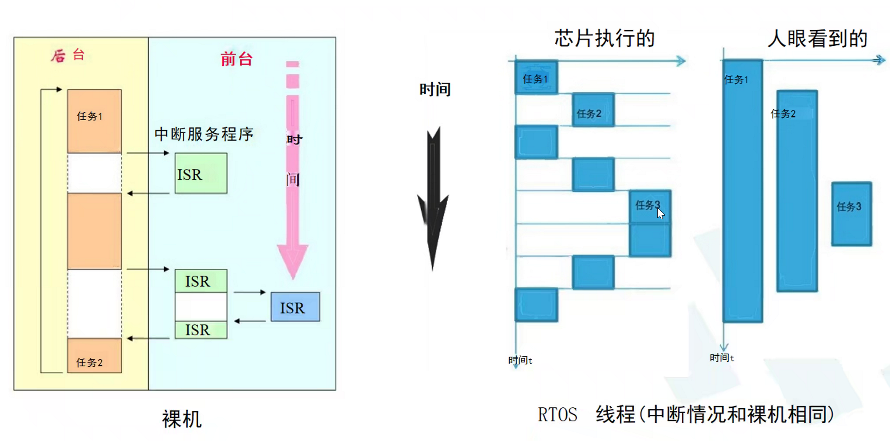
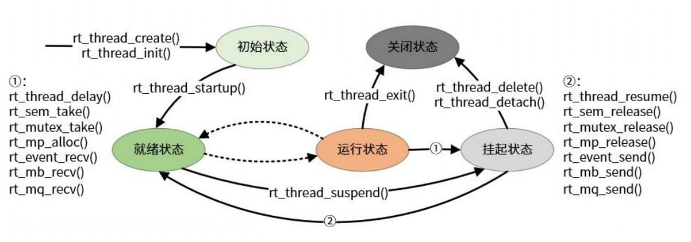
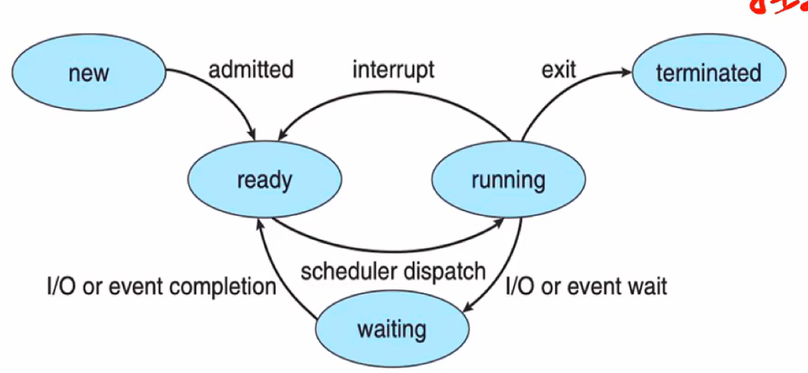
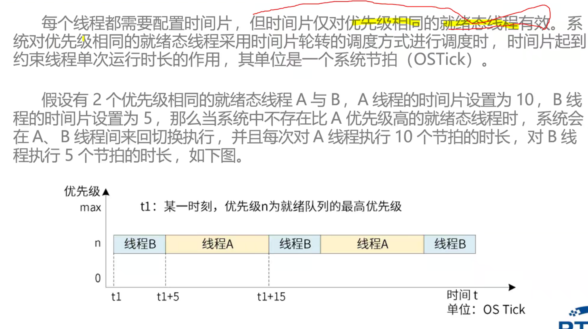
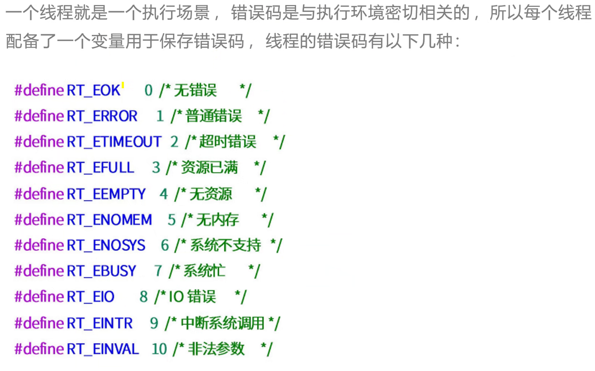
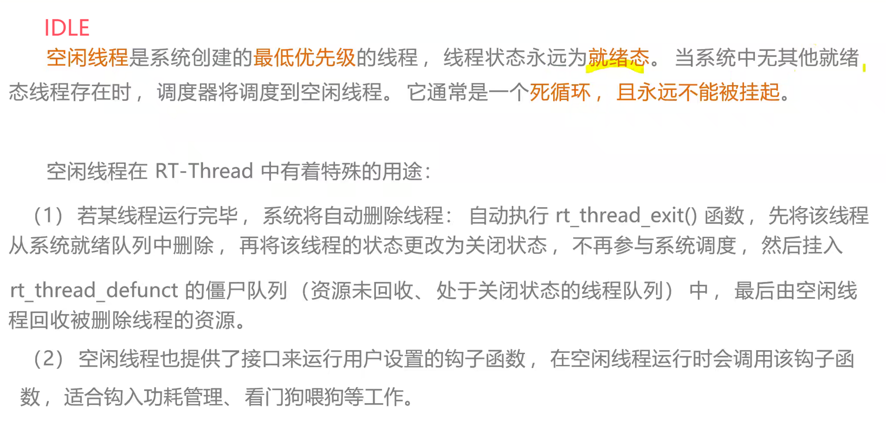
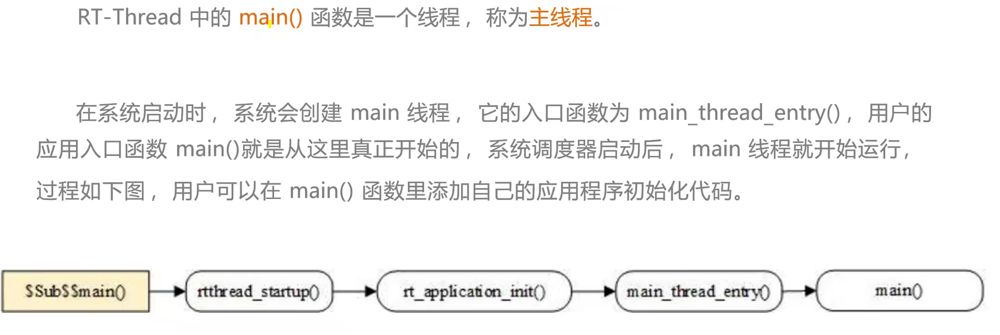
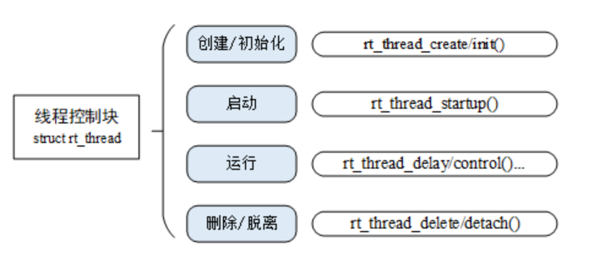
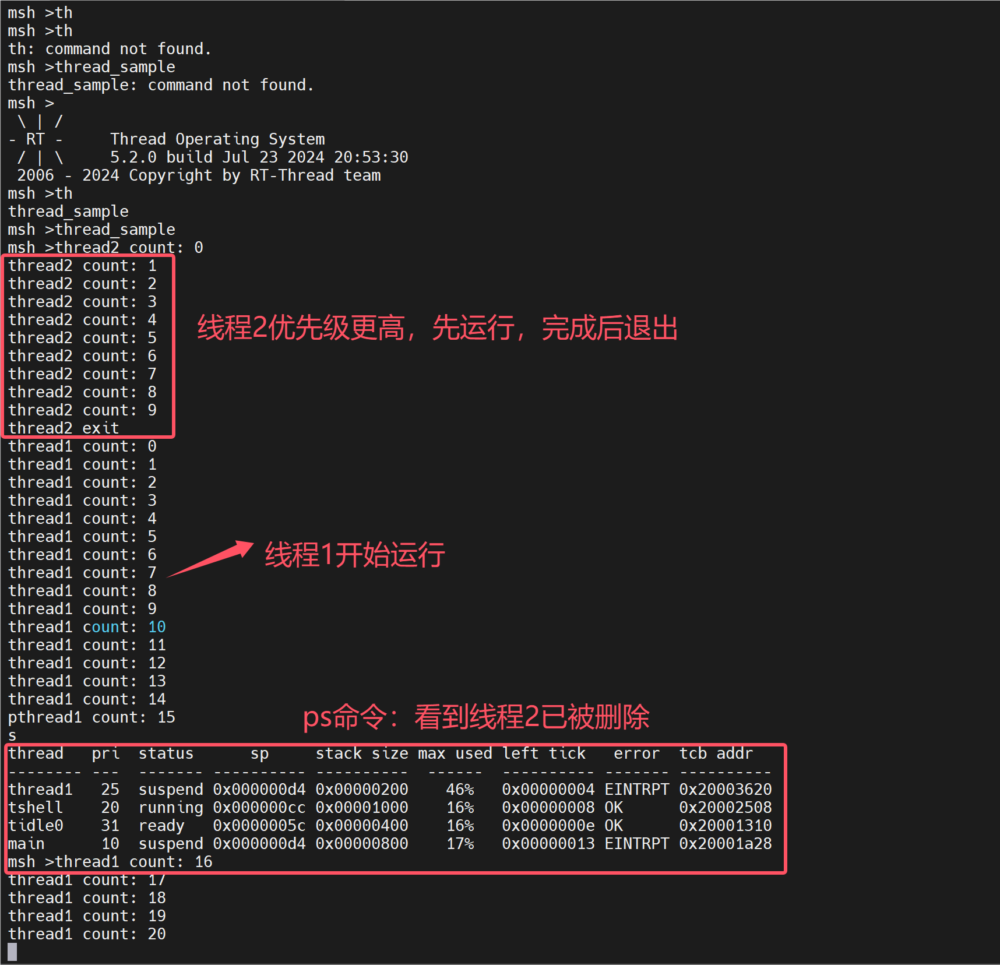
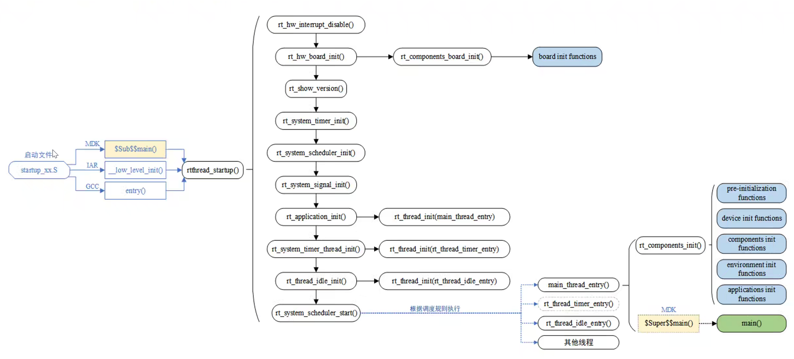

---

typora-copy-images-to: 图片
---

# Day02. RT-Thread线程管理与启动流程分析

## 一、线程基础

### RTOS核心要素


### RTOS和裸机区别：多任务系统



### 线程状态转换

rt-thread中：



一般操作系统中：


### 线程属性-时间片



**注意：只有优先级相同的线程间才可以进行时间片切换**

### 线程属性-错误码



## 二、系统线程

### 空闲线程



IDLE线程要点：

1. 所有线程运行完才执行，因为优先级最低
2. 可用来最后清除被删除线程的资源
3. 可用来运行用户设置的钩子函数

### 主线程



## 三、线程创建、启动、运行、删除一条龙



[详见RT-Thread官网]([线程管理 (rt-thread.org)](https://www.rt-thread.org/document/site/#/rt-thread-version/rt-thread-standard/programming-manual/thread/thread?id=线程的管理方式))

### 动态创建，静态初始化

动态创建：

```c
rt_thread_t rt_thread_create(const char* name,
                            void (*entry)(void* parameter),
                            void* parameter,
                            rt_uint32_t stack_size,
                            rt_uint8_t priority,
                            rt_uint32_t tick);
```

动态创建对应删除函数：

```c
rt_err_t rt_thread_delete(rt_thread_t thread);
```

静态初始化：

```c
rt_err_t rt_thread_init(struct rt_thread* thread,
                        const char* name,
                        void (*entry)(void* parameter), void* parameter,
                        void* stack_start, rt_uint32_t stack_size,
                        rt_uint8_t priority, rt_uint32_t tick);
```

静态初始化对应删除函数：

```c
rt_err_t rt_thread_detach (rt_thread_t thread);
```

### 启动线程

创建（初始化）的线程状态处于初始状态，并未进入就绪线程的调度队列，我们可以在线程初始化 / 创建成功后调用下面的函数接口让该线程进入就绪态：

```c
rt_err_t rt_thread_startup(rt_thread_t thread);
```

### 运行线程

比较多，后期补充

## 创建线程示例

这个例子创建一个动态线程初始化一个静态线程，一个线程在运行完毕后自动被系统删除，另一个线程一直打印计数，如下代码：

```c
#include <rtthread.h>

#define THREAD_PRIORITY         25
#define THREAD_STACK_SIZE       512
#define THREAD_TIMESLICE        5

static rt_thread_t tid1 = RT_NULL;

/* 线程 1 的入口函数 */
static void thread1_entry(void *parameter)
{
    rt_uint32_t count = 0;

    while (1)
    {
        /* 线程 1 采用低优先级运行，一直打印计数值 */
        rt_kprintf("thread1 count: %d\n", count ++);
        rt_thread_mdelay(500);
    }
}	

rt_align(RT_ALIGN_SIZE)
static char thread2_stack[1024];
static struct rt_thread thread2;
/* 线程 2 入口 */
static void thread2_entry(void *param)
{
    rt_uint32_t count = 0;

    /* 线程 2 拥有较高的优先级，以抢占线程 1 而获得执行 */
    for (count = 0; count < 10 ; count++)
    {
        /* 线程 2 打印计数值 */
        rt_kprintf("thread2 count: %d\n", count);
    }
    rt_kprintf("thread2 exit\n");
    /* 线程 2 运行结束后也将自动被系统脱离 */
}

/* 线程示例 */
int thread_sample(void)
{
    /* 创建线程 1，名称是 thread1，入口是 thread1_entry*/
    tid1 = rt_thread_create("thread1",
                            thread1_entry, RT_NULL,
                            THREAD_STACK_SIZE,
                            THREAD_PRIORITY, THREAD_TIMESLICE);

    /* 如果获得线程控制块，启动这个线程 */
    if (tid1 != RT_NULL)
        rt_thread_startup(tid1);

    /* 初始化线程 2，名称是 thread2，入口是 thread2_entry */
    rt_thread_init(&thread2,
                   "thread2",
                   thread2_entry,
                   RT_NULL,
                   &thread2_stack[0],
                   sizeof(thread2_stack),
                   THREAD_PRIORITY - 1, THREAD_TIMESLICE);
    rt_thread_startup(&thread2);

    return 0;
}

/* 导出到 msh 命令列表中 */
MSH_CMD_EXPORT(thread_sample, thread sample);

```

我的运行结果：



## 四、RT-Thread启动流程



比较多，后面补充


