# Day03-IPC线程间同步与通讯

## 一、env导入例程包

1. 在工程文件夹打开env

	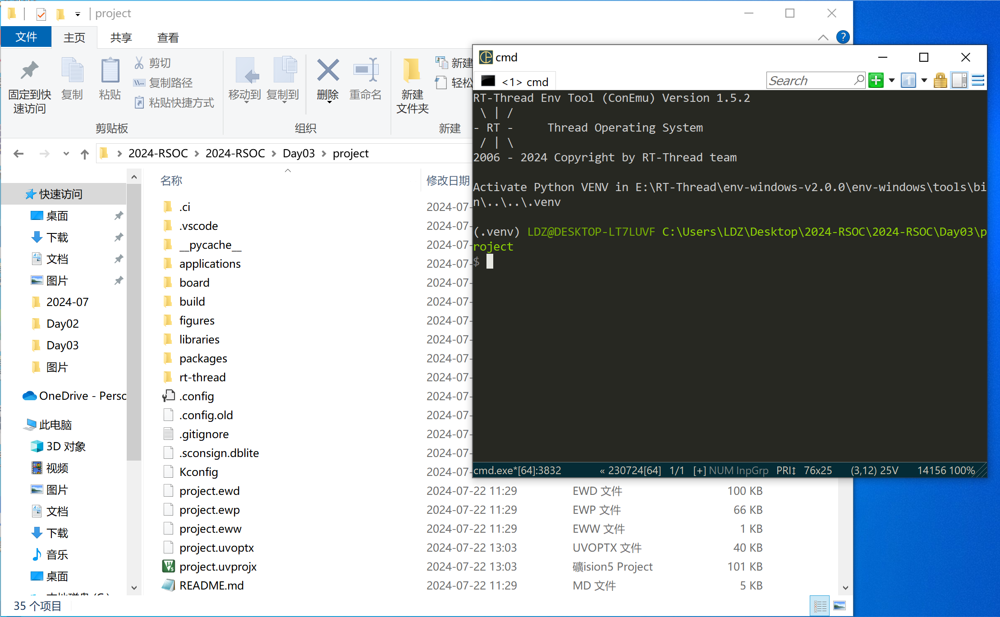

2. 输入menuconfig.exe进入配置界面

	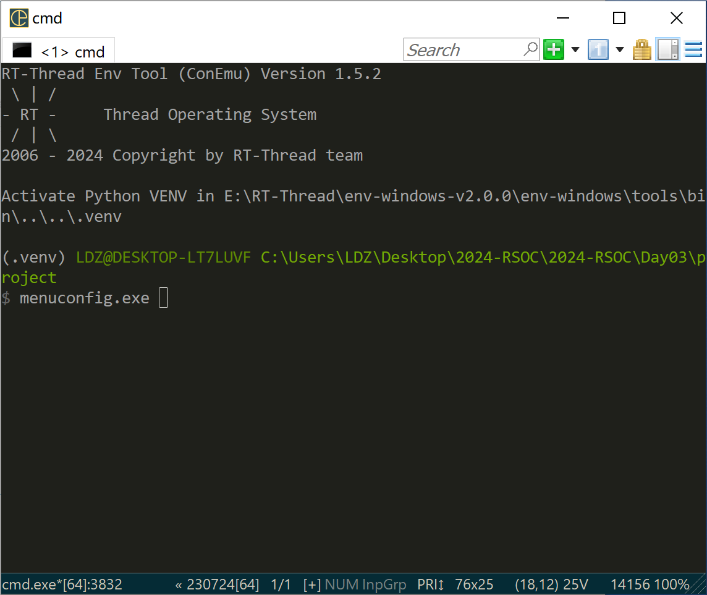

	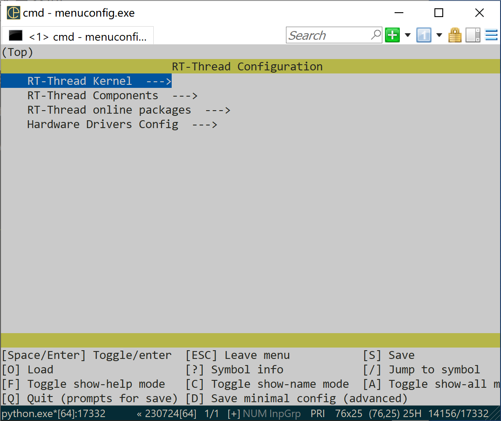

3. "/"搜索此项，并勾选想要的例程

	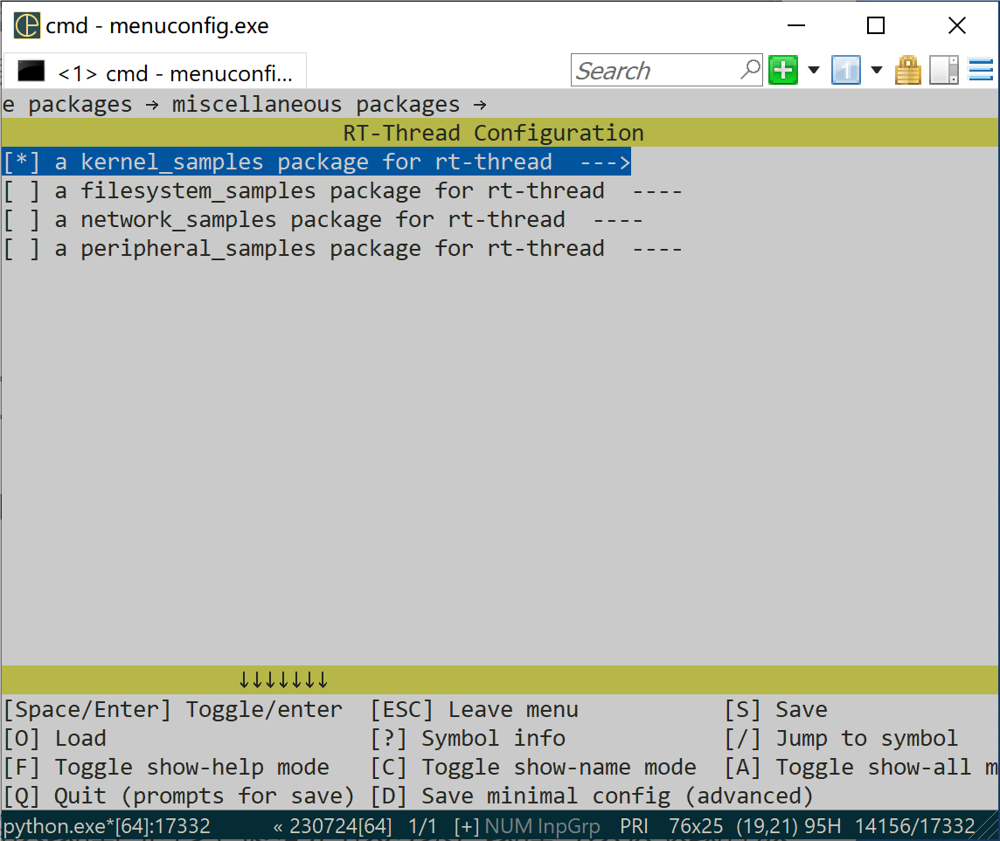

	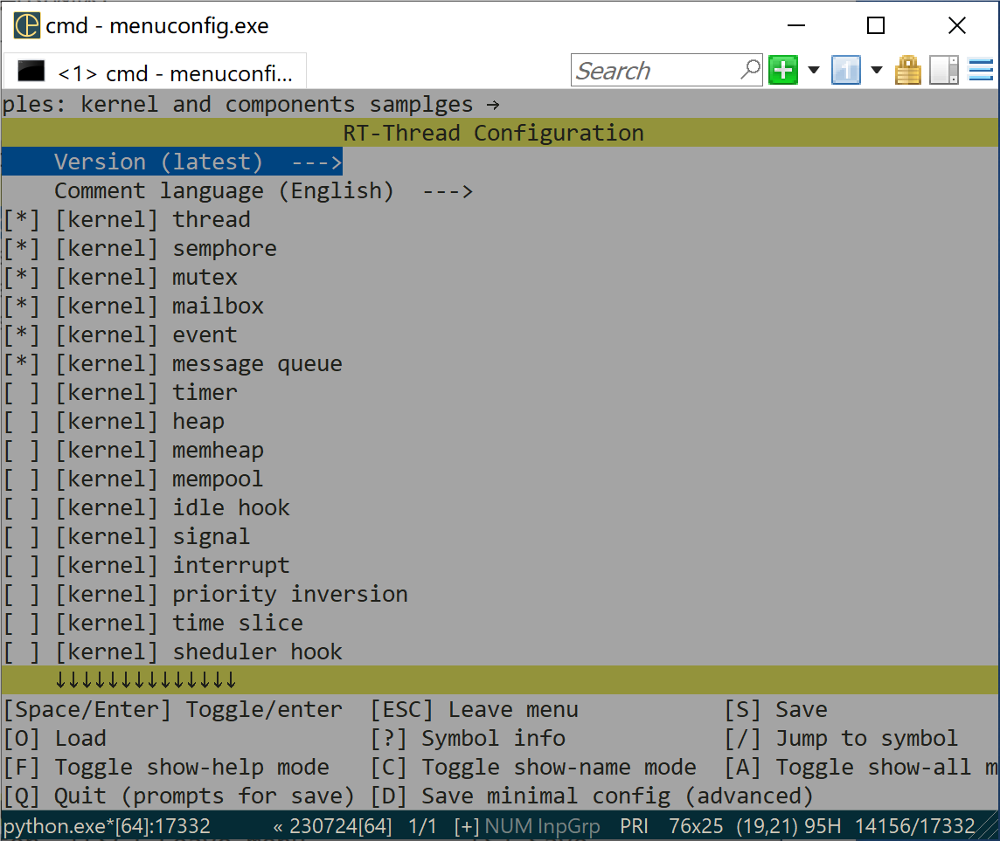

4. 退出并使用pkgs --update更新资源包

	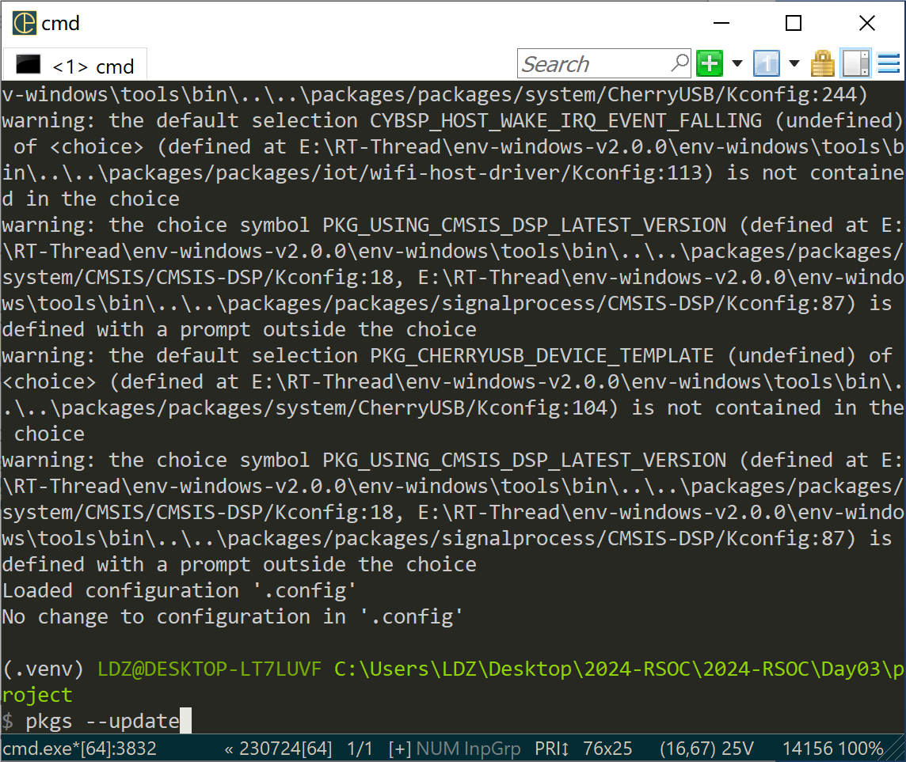

## 二、线程间同步

核心思想：**在访问临界区的时候只允许一个 (或一类) 线程运行**

### 信号量

信号量是一种轻型的用于解决线程间同步问题的内核对象，线程可以获取或释放它，从而达到同步或互斥的目的。

每个信号量对象都有一个信号量值和一个线程等待队列，信号量的值对应了信号量对象的实例数目、资源数目，假如信号量值为 5，则表示共有 5 个信号量实例（资源）可以被使用，当信号量实例数目为零时，再申请该信号量的线程就会被挂起在该信号量的等待队列上，等待可用的信号量实例（资源）。

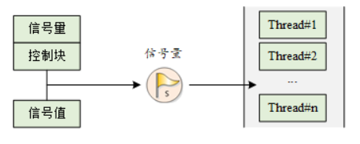

#### 信号量管理方式

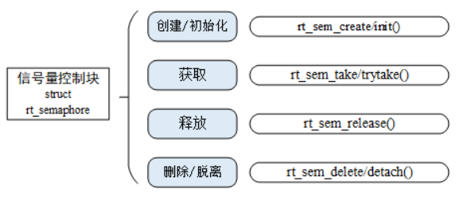

[详情见文档中心]([线程间同步 (rt-thread.org)](https://www.rt-thread.org/document/site/#/rt-thread-version/rt-thread-standard/programming-manual/ipc1/ipc1?id=信号量))

#### 信号量例程详解

例程创建了一个动态信号量，初始化两个线程，一个线程发送信号量，一个线程接收到信号量后，执行相应的操作。如下代码所示：

```c
#include <rtthread.h>

#define THREAD_PRIORITY         25
#define THREAD_TIMESLICE        5

/* semaphore handler */
static rt_sem_t dynamic_sem = RT_NULL;

#ifdef rt_align
rt_align(RT_ALIGN_SIZE)
#else
ALIGN(RT_ALIGN_SIZE)
#endif
static char thread1_stack[1024];
static struct rt_thread thread1;
static void rt_thread1_entry(void *parameter)
{
    static rt_uint8_t count = 0;

    while (1)
    {
        if (count <= 100)
        {
            count++;
        }
        else
            return;

        /* count release semaphore every 10 counts */
        if (0 == (count % 10))
        {
            rt_kprintf("thread1 release a dynamic semaphore.\n");
            rt_sem_release(dynamic_sem);
        }
    }
}

#ifdef rt_align
rt_align(RT_ALIGN_SIZE)
#else
ALIGN(RT_ALIGN_SIZE)
#endif
static char thread2_stack[1024];
static struct rt_thread thread2;
static void rt_thread2_entry(void *parameter)
{
    static rt_err_t result;
    static rt_uint8_t number = 0;
    while (1)
    {
        /* permanently wait for the semaphore; once obtain the semaphore, perform the number self-add operation */
        result = rt_sem_take(dynamic_sem, RT_WAITING_FOREVER);
        if (result != RT_EOK)
        {
            rt_kprintf("thread2 take a dynamic semaphore, failed.\n");
            rt_sem_delete(dynamic_sem);
            return;
        }
        else
        {
            number++;
            rt_kprintf("thread2 take a dynamic semaphore. number = %d\n", number);
        }
    }
}

int semaphore_sample()
{
    /* create semaphtore and its initial value is 0 */
    dynamic_sem = rt_sem_create("dsem", 0, RT_IPC_FLAG_PRIO);
    if (dynamic_sem == RT_NULL)
    {
        rt_kprintf("create dynamic semaphore failed.\n");
        return -1;
    }
    else
    {
        rt_kprintf("create done. dynamic semaphore value = 0.\n");
    }

    rt_thread_init(&thread1,
                   "thread1",
                   rt_thread1_entry,
                   RT_NULL,
                   &thread1_stack[0],
                   sizeof(thread1_stack),
                   THREAD_PRIORITY, THREAD_TIMESLICE);
#ifdef RT_USING_SMP
    /* Bind threads to the same core to avoid messy log output when multiple cores are enabled */
    rt_thread_control(&thread1, RT_THREAD_CTRL_BIND_CPU, (void*)0);
#endif
    rt_thread_startup(&thread1);

    rt_thread_init(&thread2,
                   "thread2",
                   rt_thread2_entry,
                   RT_NULL,
                   &thread2_stack[0],
                   sizeof(thread2_stack),
                   THREAD_PRIORITY - 1, THREAD_TIMESLICE);
#ifdef RT_USING_SMP
    /* Bind threads to the same core to avoid messy log output when multiple cores are enabled */
    rt_thread_control(&thread2, RT_THREAD_CTRL_BIND_CPU, (void*)0);
#endif
    rt_thread_startup(&thread2);

    return 0;
}

/* export the msh command */
MSH_CMD_EXPORT(semaphore_sample, semaphore sample);
```

我的运行结果：

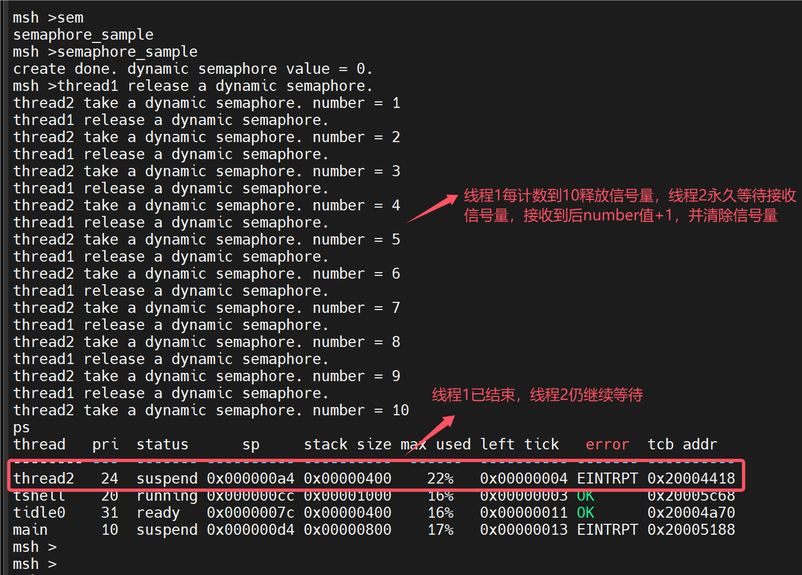

##### 重要函数

获取信号量

线程通过获取信号量来获得信号量资源实例，当信号量值大于零时，线程将获得信号量，并且相应的信号量值会减 1，获取信号量使用下面的函数接口：

```c
rt_err_t rt_sem_take (rt_sem_t sem, rt_int32_t time);
```

释放信号量

释放信号量可以唤醒挂起在该信号量上的线程。释放信号量使用下面的函数接口：

```c
rt_err_t rt_sem_release(rt_sem_t sem);
```

例如当信号量的值等于零时，并且有线程等待这个信号量时，释放信号量将唤醒等待在该信号量线程队列中的第一个线程，由它获取信号量；否则将把信号量的值加 1。**本例为第一种**

##### 信号量初始值为0时

本例为线程同步案例，是信号量最简单的一类应用。例如，使用信号量进行两个线程之间的同步，信号量的值初始化成 0，表示具备 0 个信号量资源实例；而尝试获得该信号量的线程，将直接在这个信号量上进行等待。

当持有信号量的线程完成它处理的工作时，释放这个信号量，可以把等待在这个信号量上的线程唤醒，让它执行下一部分工作。这类场合也可以看成把信号量用于工作完成标志：持有信号量的线程完成它自己的工作，然后通知等待该信号量的线程继续下一部分工作。

##### 信号量初始值为1时：二值信号量、锁

锁，单一的锁常应用于多个线程间对同一共享资源（即临界区）的访问。信号量在作为锁来使用时，通常应将信号量资源实例初始化成 1，代表系统默认有一个资源可用，因为信号量的值始终在 1 和 0 之间变动，所以这类锁也叫做二值信号量。如下图所示，当线程需要访问共享资源时，它需要先获得这个资源锁。当这个线程成功获得资源锁时，其他打算访问共享资源的线程会由于获取不到资源而挂起，这是因为其他线程在试图获取这个锁时，这个锁已经被锁上（信号量值是 0）。当获得信号量的线程处理完毕，退出临界区时，它将会释放信号量并把锁解开，而挂起在锁上的第一个等待线程将被唤醒从而获得临界区的访问权。

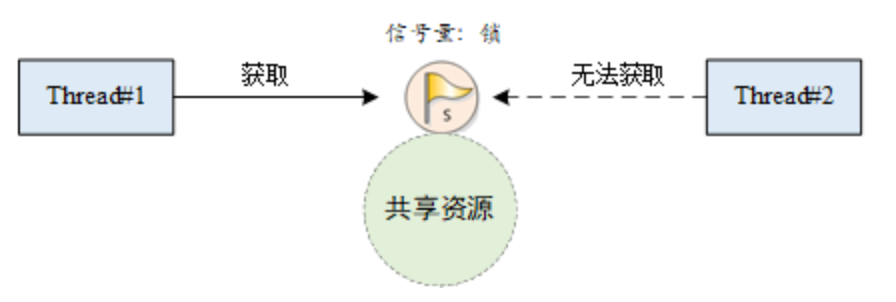

注：在计算机操作系统发展历史上，人们早期使用二值信号量来保护临界区，但是在1990年，研究人员发现了使用信号量保护临界区**会导致无界优先级反转**的问题，因此提出了互斥量的概念。**如今，我们已经不使用二值信号量来保护临界区，互斥量取而代之。**

##### 信号量初始值为n时：资源计数

信号量也可以认为是一个递增或递减的计数器，需要注意的是信号量的值非负。例如：初始化一个信号量的值为 5，则这个信号量可最大连续减少 5 次，直到计数器减为 0。资源计数适合于线程间工作处理速度不匹配的场合，这个时候信号量可以做为前一线程工作完成个数的计数，而当调度到后一线程时，它也可以以一种连续的方式一次处理多个事件。例如，生产者与消费者问题中，生产者可以对信号量进行多次释放，而后消费者被调度到时能够一次处理多个信号量资源。

### 互斥量

互斥量又叫相互排斥的信号量，是一种**特殊的二值信号量**。互斥量类似于一个单人卫生间，当一个人使用时，把门锁住，其他人在外面等待。当里面人出来时，把门打开，下一个人才可以进来。

#### 互斥量与二值信号量区别

互斥量和信号量不同的是：拥有互斥量的线程拥有互斥量的所有权，互斥量支持递归访问且能防止线程优先级翻转；并且互斥量只能由持有线程释放，而信号量则可以由任何线程释放。

互斥量的状态只有两种，开锁或闭锁（两种状态值）。当有线程持有它时，互斥量处于闭锁状态，由这个线程获得它的所有权。相反，当这个线程释放它时，将对互斥量进行开锁，失去它的所有权。当一个线程持有互斥量时，其他线程将不能够对它进行开锁或持有它，持有该互斥量的线程也能够再次获得这个锁而不被挂起，如下图时所示。这个特性与一般的二值信号量有很大的不同：在信号量中，因为已经不存在实例，线程递归持有会发生主动挂起（最终形成死锁）。

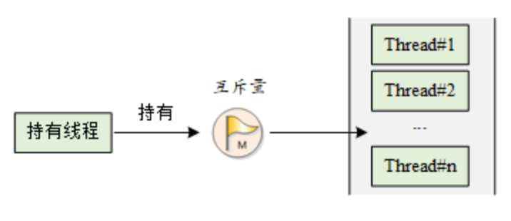

使用信号量会导致的另一个潜在问题是**线程优先级翻转问题**。所谓优先级翻转，即**当一个高优先级线程试图通过信号量机制访问共享资源时，如果该信号量已被一低优先级线程持有，而这个低优先级线程在运行过程中可能又被其它一些中等优先级的线程抢占，因此造成高优先级线程被许多具有较低优先级的线程阻塞，实时性难以得到保证。**

如下图所示：有优先级为 A、B 和 C 的三个线程，优先级 A> B > C。线程 A，B 处于挂起状态，等待某一事件触发，线程 C 正在运行，此时线程 C 开始使用某一共享资源 M。在使用过程中，线程 A 等待的事件到来，线程 A 转为就绪态，因为它比线程 C 优先级高，所以立即执行。但是当线程 A 要使用共享资源 M 时，由于其正在被线程 C 使用，因此线程 A 被挂起切换到线程 C 运行。如果此时线程 B 等待的事件到来，则线程 B 转为就绪态。由于线程 B 的优先级比线程 C 高，且线程B没有用到共享资源 M ，因此线程 B 开始运行，直到其运行完毕，线程 C 才开始运行。只有当线程 C 释放共享资源 M 后，线程 A 才得以执行。在这种情况下，优先级发生了翻转：线程 B 先于线程 A 运行。这样便不能保证高优先级线程的响应时间。

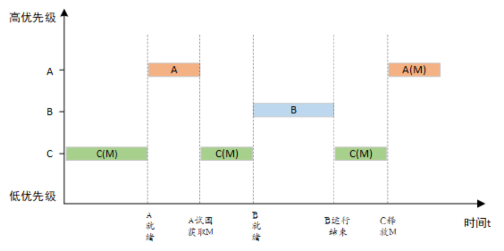

在 RT-Thread 操作系统中，互斥量可以解决优先级翻转问题，实现的是优先级继承协议 (Sha, 1990)。**优先级继承是通过在线程 A 尝试获取共享资源而被挂起的期间内，将线程 C 的优先级提升到线程 A 的优先级别，从而解决优先级翻转引起的问题。**这样能够防止 C（间接地防止 A）被 B 抢占，如下图所示。优先级继承是指，提高某个占有某种资源的低优先级线程的优先级，使之与所有等待该资源的线程中优先级最高的那个线程的优先级相等，然后执行，而当这个低优先级线程释放该资源时，优先级重新回到初始设定。因此，继承优先级的线程避免了系统资源被任何中间优先级的线程抢占。

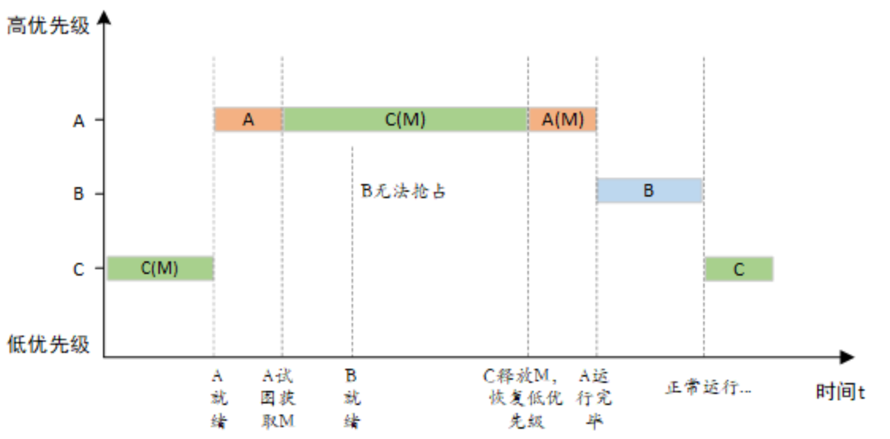

注：**在获得互斥量后，请尽快释放互斥量，并且在持有互斥量的过程中，不得再行更改持有互斥量线程的优先级，否则可能人为引入无界优先级反转的问题。**

#### 互斥量管理方式

互斥量控制块中含有互斥相关的重要参数，在互斥量功能的实现中起到重要的作用。互斥量相关接口如下图所示，对一个互斥量的操作包含：创建 / 初始化互斥量、获取互斥量、释放互斥量、删除 / 脱离互斥量。

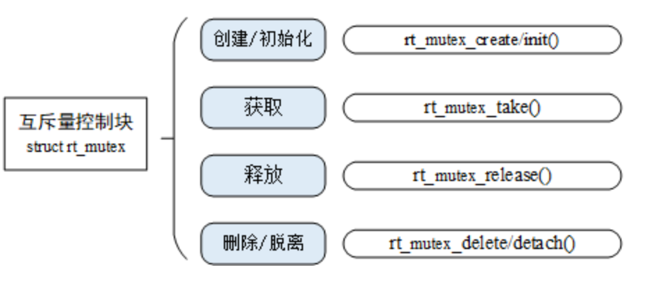

[详情见文档]([线程间同步 (rt-thread.org)](https://www.rt-thread.org/document/site/#/rt-thread-version/rt-thread-standard/programming-manual/ipc1/ipc1?id=互斥量))

#### 互斥锁例程详解

这是一个互斥量的应用例程，互斥锁是一种保护共享资源的方法。当一个线程拥有互斥锁的时候，可以保护共享资源不被其他线程破坏。下面用一个例子来说明，有两个线程：线程 1 和线程 2，线程 1 对 2 个 number 分别进行加 1 操作；线程 2 也对 2 个 number 分别进行加 1 操作，使用互斥量保证线程改变 2 个 number 值的操作不被打断。如下代码所示：

```c
#include <rtthread.h>

#define THREAD_PRIORITY         8
#define THREAD_TIMESLICE        5

/* 指向互斥量的指针 */
static rt_mutex_t dynamic_mutex = RT_NULL;
static rt_uint8_t number1,number2 = 0;

ALIGN(RT_ALIGN_SIZE)
static char thread1_stack[1024];
static struct rt_thread thread1;
static void rt_thread_entry1(void *parameter)
{
      while(1)
      {
          /* 线程 1 获取到互斥量后，先后对 number1、number2 进行加 1 操作，然后释放互斥量 */
          rt_mutex_take(dynamic_mutex, RT_WAITING_FOREVER);
          number1++;
          rt_thread_mdelay(10);
          number2++;
          rt_mutex_release(dynamic_mutex);
       }
}

ALIGN(RT_ALIGN_SIZE)
static char thread2_stack[1024];
static struct rt_thread thread2;
static void rt_thread_entry2(void *parameter)
{
      while(1)
      {
          /* 线程 2 获取到互斥量后，检查 number1、number2 的值是否相同，相同则表示 mutex 起到了锁的作用 */
          rt_mutex_take(dynamic_mutex, RT_WAITING_FOREVER);
          if(number1 != number2)
          {
            rt_kprintf("not protect.number1 = %d, mumber2 = %d \n",number1 ,number2);
          }
          else
          {
            rt_kprintf("mutex protect ,number1 = mumber2 is %d\n",number1);
          }

           number1++;
           number2++;
           rt_mutex_release(dynamic_mutex);

          if(number1>=50)
              return;
      }
}

/* 互斥量示例的初始化 */
int mutex_sample(void)
{
    /* 创建一个动态互斥量 */
    dynamic_mutex = rt_mutex_create("dmutex", RT_IPC_FLAG_PRIO);
    if (dynamic_mutex == RT_NULL)
    {
        rt_kprintf("create dynamic mutex failed.\n");
        return -1;
    }

    rt_thread_init(&thread1,
                   "thread1",
                   rt_thread_entry1,
                   RT_NULL,
                   &thread1_stack[0],
                   sizeof(thread1_stack),
                   THREAD_PRIORITY, THREAD_TIMESLICE);
    rt_thread_startup(&thread1);

    rt_thread_init(&thread2,
                   "thread2",
                   rt_thread_entry2,
                   RT_NULL,
                   &thread2_stack[0],
                   sizeof(thread2_stack),
                   THREAD_PRIORITY-1, THREAD_TIMESLICE);
    rt_thread_startup(&thread2);
    return 0;
}

/* 导出到 MSH 命令列表中 */
MSH_CMD_EXPORT(mutex_sample, mutex sample);

```

我的运行结果：

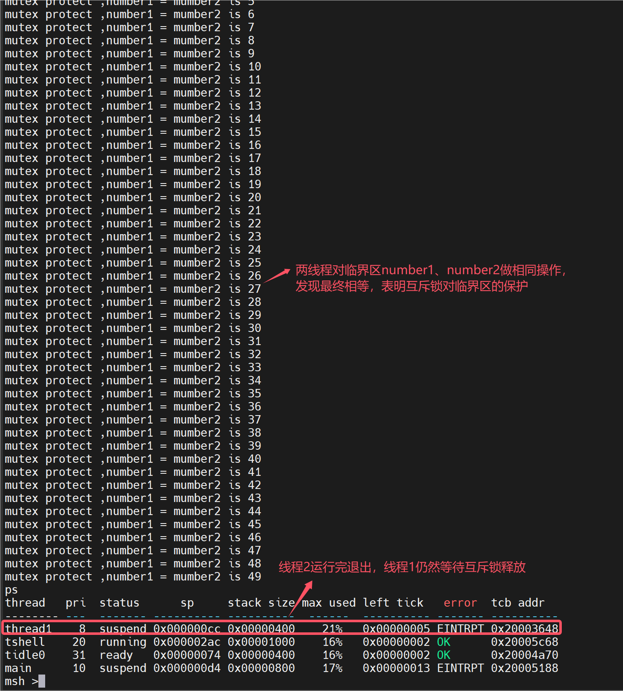

典型PV操作，保护临界区

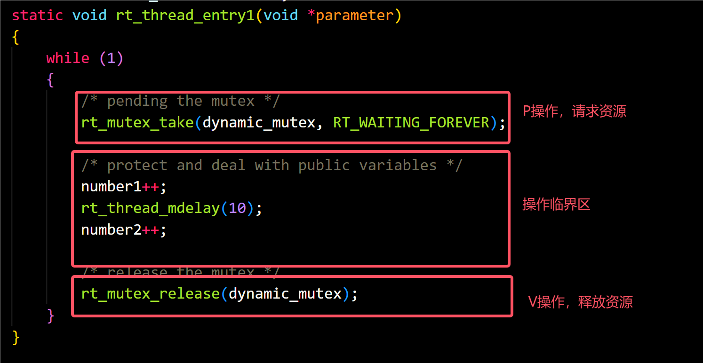

##### 重要函数：

获取互斥量（P操作）

线程获取了互斥量，那么线程就有了对该互斥量的所有权，即某一个时刻一个互斥量只能被一个线程持有。获取互斥量使用下面的函数接口：

```c
rt_err_t rt_mutex_take (rt_mutex_t mutex, rt_int32_t time);
```

如果互斥量没有被其他线程控制，那么申请该互斥量的线程将成功获得该互斥量。如果互斥量已经被当前线程线程控制，则该互斥量的持有计数加 1，当前线程也不会挂起等待。如果互斥量已经被其他线程占有，则当前线程在该互斥量上挂起等待，直到其他线程释放它或者等待时间超过指定的超时时间。

释放互斥量（V操作）

当线程完成互斥资源的访问后，应尽快释放它占据的互斥量，使得其他线程能及时获取该互斥量。释放互斥量使用下面的函数接口：

```c
rt_err_t rt_mutex_release(rt_mutex_t mutex);复制错误复制成功
```

使用该函数接口时，只有已经拥有互斥量控制权的线程才能释放它，每释放一次该互斥量，它的持有计数就减 1。当该互斥量的持有计数为零时（即持有线程已经释放所有的持有操作），它变为可用，等待在该互斥量上的线程将被唤醒。如果线程的运行优先级被互斥量提升，那么当互斥量被释放后，线程恢复为持有互斥量前的优先级。

### 事件集

事件集也是线程间同步的机制之一，一个事件集可以包含多个事件，利用事件集可以完成一对多，多对多的线程间同步。下面以坐公交为例说明事件，在公交站等公交时可能有以下几种情况：

①P1 坐公交去某地，只有一种公交可以到达目的地，等到此公交即可出发。

②P1 坐公交去某地，有 3 种公交都可以到达目的地，等到其中任意一辆即可出发。

③P1 约另一人 P2 一起去某地，则 P1 必须要等到 “同伴 P2 到达公交站” 与“公交到达公交站”两个条件都满足后，才能出发。

这里，可以将 P1 去某地视为线程，将 “公交到达公交站”、“同伴 P2 到达公交站” 视为事件的发生，情况①是特定事件唤醒线程；情况②是任意单个事件唤醒线程；情况③是多个事件同时发生才唤醒线程。

#### 事件集工作机制

事件集主要用于线程间的同步，与信号量不同，它的特点是**可以实现一对多，多对多的同步**。即一个线程与多个事件的关系可设置为：其中任意一个事件唤醒线程，或几个事件都到达后才唤醒线程进行后续的处理；同样，事件也可以是多个线程同步多个事件。这种多个事件的集合可以用一个 32 位无符号整型变量来表示，变量的每一位代表一个事件，线程通过 “逻辑与” 或“逻辑或”将一个或多个事件关联起来，形成事件组合。**事件的 “逻辑或” 也称为是独立型同步，指的是线程与任何事件之一发生同步；事件 “逻辑与” 也称为是关联型同步，指的是线程与若干事件都发生同步。**

RT-Thread 定义的事件集有以下特点：

1）事件只与线程相关，事件间相互独立：每个线程可拥有 32 个事件标志，采用一个 32 bit 无符号整型数进行记录，每一个 bit 代表一个事件；

2）事件仅用于同步，不提供数据传输功能；

3）事件无排队性，即多次向线程发送同一事件 (如果线程还未来得及读走)，其效果等同于只发送一次。

在 RT-Thread 中，每个线程都拥有一个事件信息标记，它有三个属性，分别是 RT_EVENT_FLAG_AND(逻辑与)，RT_EVENT_FLAG_OR(逻辑或）以及 RT_EVENT_FLAG_CLEAR(清除标记）。当线程等待事件同步时，可以通过 32 个事件标志和这个事件信息标记来判断当前接收的事件是否满足同步条件。

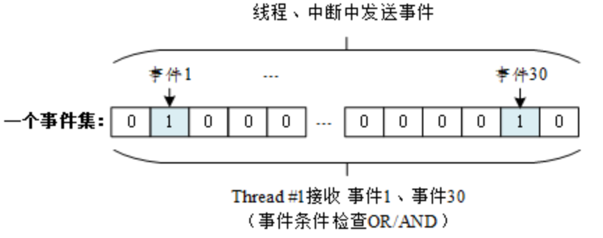

如上图所示，线程 #1 的事件标志中第 1 位和第 30 位被置位，如果事件信息标记位设为逻辑与，则表示线程 #1 只有在事件 1 和事件 30 都发生以后才会被触发唤醒，如果事件信息标记位设为逻辑或，则事件 1 或事件 30 中的任意一个发生都会触发唤醒线程 #1。如果信息标记同时设置了清除标记位，则当线程 #1 唤醒后将主动把事件 1 和事件 30 清为零，否则事件标志将依然存在（即置 1）。

#### 事件集管理方式

事件集控制块中含有与事件集相关的重要参数，在事件集功能的实现中起重要的作用。事件集相关接口如下图所示，对一个事件集的操作包含：创建 / 初始化事件集、发送事件、接收事件、删除 / 脱离事件集。

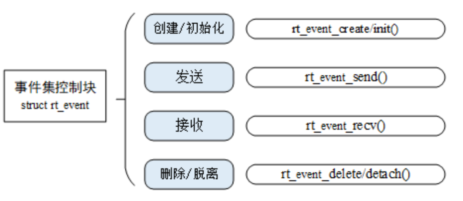

[详情见文档]([线程间同步 (rt-thread.org)](https://www.rt-thread.org/document/site/#/rt-thread-version/rt-thread-standard/programming-manual/ipc1/ipc1?id=事件集))

#### 事件集例程详解

这是事件集的应用例程，例子中初始化了一个事件集，两个线程。一个线程等待自己关心的事件发生，另外一个线程发送事件，如以下代码所示：

```c
#include <rtthread.h>

#define THREAD_PRIORITY      9
#define THREAD_TIMESLICE     5

#define EVENT_FLAG3 (1 << 3)
#define EVENT_FLAG5 (1 << 5)

/* 事件控制块 */
static struct rt_event event;

ALIGN(RT_ALIGN_SIZE)
static char thread1_stack[1024];
static struct rt_thread thread1;

/* 线程 1 入口函数 */
static void thread1_recv_event(void *param)
{
    rt_uint32_t e;

    /* 第一次接收事件，事件 3 或事件 5 任意一个可以触发线程 1，接收完后清除事件标志 */
    if (rt_event_recv(&event, (EVENT_FLAG3 | EVENT_FLAG5),
                      RT_EVENT_FLAG_OR | RT_EVENT_FLAG_CLEAR,
                      RT_WAITING_FOREVER, &e) == RT_EOK)
    {
        rt_kprintf("thread1: OR recv event 0x%x\n", e);
    }

    rt_kprintf("thread1: delay 1s to prepare the second event\n");
    rt_thread_mdelay(1000);

    /* 第二次接收事件，事件 3 和事件 5 均发生时才可以触发线程 1，接收完后清除事件标志 */
    if (rt_event_recv(&event, (EVENT_FLAG3 | EVENT_FLAG5),
                      RT_EVENT_FLAG_AND | RT_EVENT_FLAG_CLEAR,
                      RT_WAITING_FOREVER, &e) == RT_EOK)
    {
        rt_kprintf("thread1: AND recv event 0x%x\n", e);
    }
    rt_kprintf("thread1 leave.\n");
}


ALIGN(RT_ALIGN_SIZE)
static char thread2_stack[1024];
static struct rt_thread thread2;

/* 线程 2 入口 */
static void thread2_send_event(void *param)
{
    rt_kprintf("thread2: send event3\n");
    rt_event_send(&event, EVENT_FLAG3);
    rt_thread_mdelay(200);

    rt_kprintf("thread2: send event5\n");
    rt_event_send(&event, EVENT_FLAG5);
    rt_thread_mdelay(200);

    rt_kprintf("thread2: send event3\n");
    rt_event_send(&event, EVENT_FLAG3);
    rt_kprintf("thread2 leave.\n");
}

int event_sample(void)
{
    rt_err_t result;

    /* 初始化事件对象 */
    result = rt_event_init(&event, "event", RT_IPC_FLAG_PRIO);
    if (result != RT_EOK)
    {
        rt_kprintf("init event failed.\n");
        return -1;
    }

    rt_thread_init(&thread1,
                   "thread1",
                   thread1_recv_event,
                   RT_NULL,
                   &thread1_stack[0],
                   sizeof(thread1_stack),
                   THREAD_PRIORITY - 1, THREAD_TIMESLICE);
    rt_thread_startup(&thread1);

    rt_thread_init(&thread2,
                   "thread2",
                   thread2_send_event,
                   RT_NULL,
                   &thread2_stack[0],
                   sizeof(thread2_stack),
                   THREAD_PRIORITY, THREAD_TIMESLICE);
    rt_thread_startup(&thread2);

    return 0;
}

/* 导出到 msh 命令列表中 */
MSH_CMD_EXPORT(event_sample, event sample);
```

我的运行结果：

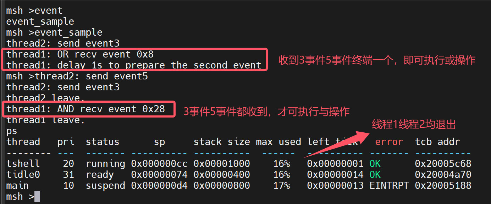

##### 重要函数：

发送事件

发送事件函数可以发送事件集中的一个或多个事件，如下：

```c
rt_err_t rt_event_send(rt_event_t event, rt_uint32_t set);
```

使用该函数接口时，通过参数 set 指定的事件标志来设定 event 事件集对象的事件标志值，然后遍历等待在 event 事件集对象上的等待线程链表，判断是否有线程的事件激活要求与当前 event 对象事件标志值匹配，如果有，则唤醒该线程。

接收事件

内核使用 32 位的无符号整数来标识事件集，它的每一位代表一个事件，因此一个事件集对象可同时等待接收 32 个事件，内核可以通过指定选择参数 “逻辑与” 或“逻辑或”来选择如何激活线程，使用 “逻辑与” 参数表示只有当所有等待的事件都发生时才激活线程，而使用 “逻辑或” 参数则表示只要有一个等待的事件发生就激活线程。接收事件使用下面的函数接口：

```c
rt_err_t rt_event_recv(rt_event_t event,
                           rt_uint32_t set,
                           rt_uint8_t option,
                           rt_int32_t timeout,
                           rt_uint32_t* recved);
```

当用户调用这个接口时，系统首先根据 set 参数和接收选项 option 来判断它要接收的事件是否发生，如果已经发生，则根据参数 option 上是否设置有 RT_EVENT_FLAG_CLEAR 来决定是否重置事件的相应标志位，然后返回（其中 recved 参数返回接收到的事件）；如果没有发生，则把等待的 set 和 option 参数填入线程本身的结构中，然后把线程挂起在此事件上，直到其等待的事件满足条件或等待时间超过指定的超时时间。如果超时时间设置为零，则表示当线程要接受的事件没有满足其要求时就不等待，而直接返回 - RT_ETIMEOUT。


