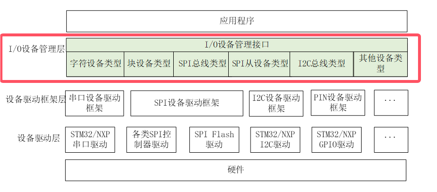
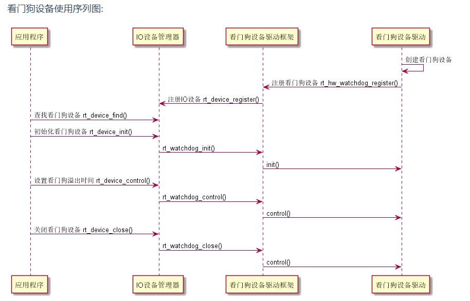
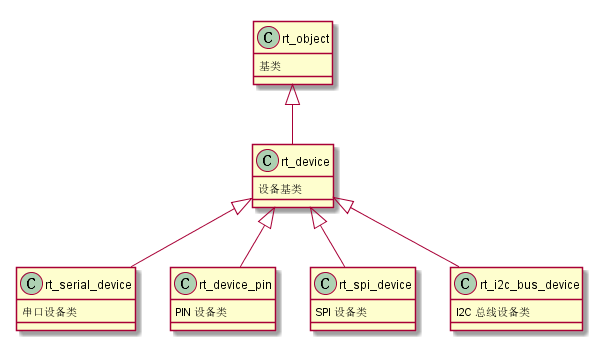
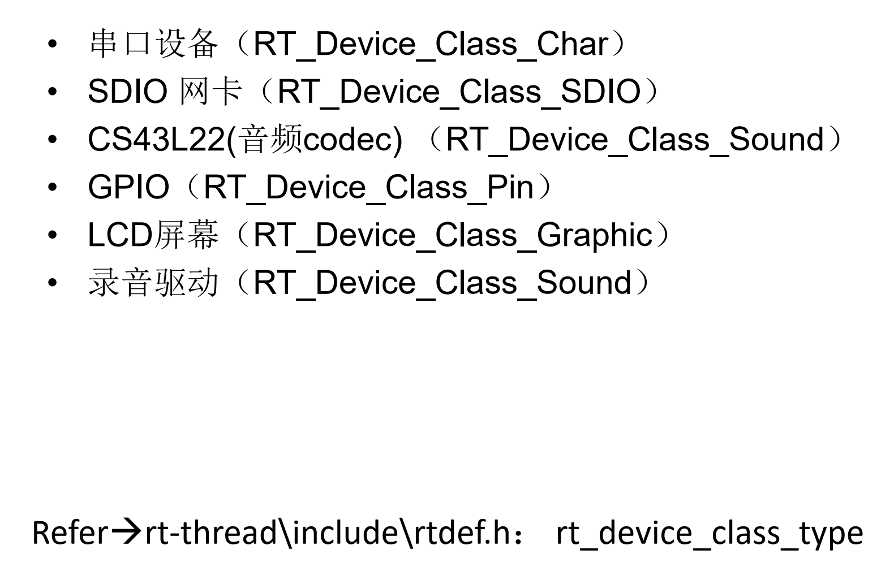
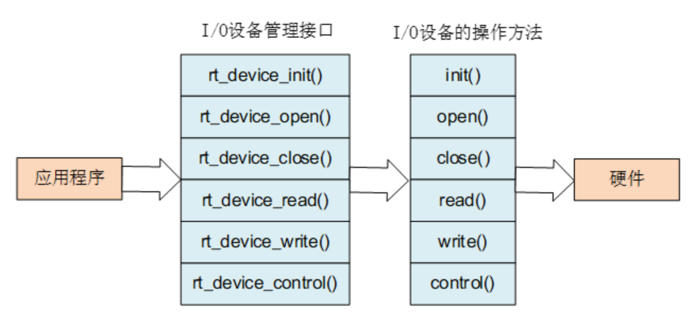
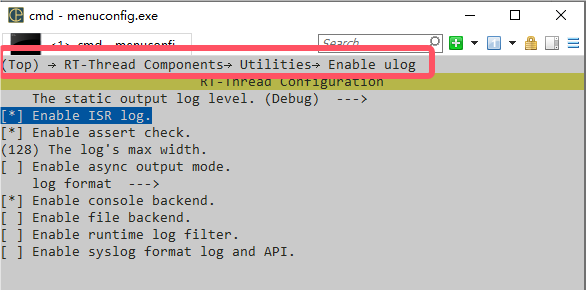
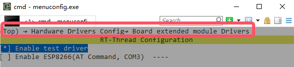
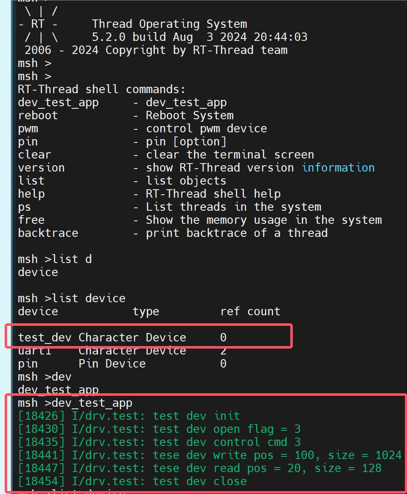

# Day04-设备驱动

## 为什么要使用设备驱动

原因：**代码复用**

我们在开发过程中很可能会遇到这样的问题：今天下来一个产品，它使用的业务逻辑和之前的一个产品很像，可以直接拿来用，但要求的开发平台不一样，只要移植上去就可以下班了。决定是否提前下班的就是是否使用设备驱动

没使用设备驱动：

从底往上，先熟悉新的开发环境，再看看之前的代码用到的接口函数长什么样，照着原来的接口编写底层驱动代码。一次两次还好，如果有好几个驱动需要重写就很麻烦了，每次都要用不同的接口。程序员最不喜欢干的就是一样的内容写好几个不同的代码。

使用设备驱动：

设备驱动就是把接口函数给规定死了，所有逻辑都用那一类接口，后面需要什么新的传感器或需要用以前的逻辑，就可以直接根据接口添加，逻辑直接copy即可，十分方便。而这些统一的接口抽象一下，也就是RT-Thread中的I/O设备管理层。



设备驱动时序图：



## I/O设备模型


RT-Thread 的设备模型是建立在内核对象模型基础之上的，设备被认为是一类对象，被纳入对象管理器的范畴。每个设备对象都是由基对象派生而来，每个具体设备都可以继承其父类对象的属性，并派生出其私有属性，下图是设备对象的继承和派生关系示意图。



### 支持 I/O 设备类型

```c
RT_Device_Class_Char             /* 字符设备       */
RT_Device_Class_Block            /* 块设备         */
RT_Device_Class_NetIf            /* 网络接口设备    */
RT_Device_Class_MTD              /* 内存设备       */
RT_Device_Class_RTC              /* RTC 设备        */
RT_Device_Class_Sound            /* 声音设备        */
RT_Device_Class_Graphic          /* 图形设备        */
RT_Device_Class_I2CBUS           /* I2C 总线设备     */
RT_Device_Class_USBDevice        /* USB device 设备  */
RT_Device_Class_USBHost          /* USB host 设备   */
RT_Device_Class_SPIBUS           /* SPI 总线设备     */
RT_Device_Class_SPIDevice        /* SPI 设备        */
RT_Device_Class_SDIO             /* SDIO 设备       */
RT_Device_Class_Miscellaneous    /* 杂类设备        */

```

#### 字符/块类型设备

字符设备和块设备的特点与区别:
• 字符设备：提供连续的数据流，应用程序可以顺序读取，通常不支持随机存取。相反，
此类设备支持按字节/字符来读写数据。举例来说，键盘、串口、调制解调器都是典型
的字符设备
• 块设备：应用程序可以随机访问设备数据，程序可自行确定读取数据的位置。硬盘、
软盘、 CD-ROM驱动器和闪存都是典型的块设备，应用程序可以寻址磁盘上的任何位
置，并由此读取数据。此外，数据的读写只能以块(通常是512B)的倍数进行。与字符
设备不同，块设备并不支持基于字符的寻址。
总结一下，这两种类型的设备的根本区别在于它们是否可以被随机访问。字符设备只能
**顺序读取**，块设备可以**随机读取**  

#### 其他设备



## 创建和注册I/O设备

驱动层负责创建设备实例，并注册到 I/O 设备管理器中，可以通过静态申明的方式创建设备实例，也可以用下面的接口进行动态创建：

```c
rt_device_t rt_device_create(int type, int attach_size);复制错误复制成功
```

| **参数**    | **描述**                               |
| ----------- | -------------------------------------- |
| type        | 设备类型，可取前面小节列出的设备类型值 |
| attach_size | 用户数据大小                           |
| **返回**    | ——                                     |
| 设备句柄    | 创建成功                               |
| RT_NULL     | 创建失败，动态内存分配失败             |

调用该接口时，系统会从动态堆内存中分配一个设备控制块，大小为 struct rt_device 和 attach_size 的和，设备的类型由参数 type 设定。设备被创建后，需要实现它访问硬件的操作方法。

```c
struct rt_device_ops
{
    /* common device interface */
    rt_err_t  (*init)   (rt_device_t dev);
    rt_err_t  (*open)   (rt_device_t dev, rt_uint16_t oflag);
    rt_err_t  (*close)  (rt_device_t dev);
    rt_size_t (*read)   (rt_device_t dev, rt_off_t pos, void *buffer, rt_size_t size);
    rt_size_t (*write)  (rt_device_t dev, rt_off_t pos, const void *buffer, rt_size_t size);
    rt_err_t  (*control)(rt_device_t dev, int cmd, void *args);
};
复制错误复制成功
```

各个操作方法的描述如下表所示：

| **方法名称** | **方法描述**                                                 |
| ------------ | ------------------------------------------------------------ |
| init         | 初始化设备。设备初始化完成后，设备控制块的 flag 会被置成已激活状态 (RT_DEVICE_FLAG_ACTIVATED)。如果设备控制块中的 flag 标志已经设置成激活状态，那么再运行初始化接口时会立刻返回，而不会重新进行初始化。 |
| open         | 打开设备。有些设备并不是系统一启动就已经打开开始运行，或者设备需要进行数据收发，但如果上层应用还未准备好，设备也不应默认已经使能并开始接收数据。所以建议在写底层驱动程序时，在调用 open 接口时才使能设备。 |
| close        | 关闭设备。在打开设备时，设备控制块会维护一个打开计数，在打开设备时进行 + 1 操作，在关闭设备时进行 - 1 操作，当计数器变为 0 时，才会进行真正的关闭操作。 |
| read         | 从设备读取数据。参数 pos 是读取数据的偏移量，但是有些设备并不一定需要指定偏移量，例如串口设备，设备驱动应忽略这个参数。而对于块设备来说，pos 以及 size 都是以块设备的数据块大小为单位的。例如块设备的数据块大小是 512，而参数中 pos = 10, size = 2，那么驱动应该返回设备中第 10 个块 （从第 0 个块做为起始），共计 2 个块的数据。这个接口返回的类型是 rt_size_t，即读到的字节数或块数目。正常情况下应该会返回参数中 size 的数值，如果返回零请设置对应的 errno 值。 |
| write        | 向设备写入数据。参数 pos 是写入数据的偏移量。与读操作类似，对于块设备来说，pos 以及 size 都是以块设备的数据块大小为单位的。这个接口返回的类型是 rt_size_t，即真实写入数据的字节数或块数目。正常情况下应该会返回参数中 size 的数值，如果返回零请设置对应的 errno 值。 |
| control      | 根据 cmd 命令控制设备。命令往往是由底层各类设备驱动自定义实现。例如参数 RT_DEVICE_CTRL_BLK_GETGEOME，意思是获取块设备的大小信息。 |

示例：

```c
#include <rtthread.h>
#include <rtdevice.h>

// #define DRV_DEBUG
#define LOG_TAG "drv.test"
#include <drv_log.h>

#if defined(BSP_USING_TEST)

static rt_err_t dev_test_init(rt_device_t dev) {
    LOG_I("test dev init");
    return RT_EOK;
}
static rt_err_t dev_test_open(rt_device_t dev, rt_uint16_t oflag) {
    LOG_I("test dev open flag = %d", oflag);
    return RT_EOK;
}
static rt_err_t dev_test_close(rt_device_t dev) {
    LOG_I("test dev close");
    return RT_EOK;
}
static rt_ssize_t dev_test_read(rt_device_t dev, rt_off_t pos, void *buffer, rt_size_t size) {
    LOG_I("tese dev read pos = %d, size = %d", pos, size);
    return RT_EOK;
}
static rt_ssize_t drv_test_write(rt_device_t dev, rt_off_t pos, const void *buffer, rt_size_t size) {
    LOG_I("tese dev write pos = %d, size = %d", pos, size);
    return RT_EOK;
}
static rt_err_t drv_test_control(rt_device_t dev, int cmd, void *args) {
    LOG_I("test dev control cmd %d", cmd);
    return RT_EOK;
}
int rt_drv_test_init(void)
{
    rt_device_t test_dev = rt_device_create(RT_Device_Class_Char, 0);
    if (!test_dev) {
        LOG_E("test dev create failed.");
        return -RT_ERROR;
    }
    test_dev->init = dev_test_init;
    test_dev->open = dev_test_open;
    test_dev->close = dev_test_close;
    test_dev->read = dev_test_read;
    test_dev->write = drv_test_write;
    test_dev->control = drv_test_control;
    if (rt_device_register(test_dev, "test_dev", RT_DEVICE_FLAG_RDWR) != RT_EOK) {
        LOG_E("test dev register failed.");
        return -RT_ERROR;
    }
    return RT_EOK;
}
INIT_BOARD_EXPORT(rt_drv_test_init); // 内核启动前进行组件初始化

#endif
```

## 访问I/O设备

应用程序通过 I/O 设备管理接口来访问硬件设备，当设备驱动实现后，应用程序就可以访问该硬件。I/O 设备管理接口与 I/O 设备的操作方法的映射关系下图所示：



示例：

```c
#include <rtthread.h>
#include <rtdevice.h>

#define LOG_TAG "drv.test"
#define LOG_LVL LOG_LVL_DBG
#include <ulog.h>

static int dev_test_app(void)
{
    rt_device_t test_dev = rt_device_find("test_dev");
    if (test_dev == RT_NULL)
    {
        LOG_E("can't find test dev.");
        return -RT_ERROR;
    }
    rt_device_open(test_dev, RT_DEVICE_OFLAG_RDWR);
    rt_device_control(test_dev, RT_DEVICE_CTRL_CONFIG, RT_NULL);
    rt_device_write(test_dev, 100, RT_NULL, 1024);
    rt_device_read(test_dev, 20, RT_NULL, 128);
    rt_device_close(test_dev);
    return RT_EOK;
}
MSH_CMD_EXPORT(dev_test_app, dev_test_app);
```

## 自己从零编写一个字符驱动

#### 1. 创建和注册I/O设备

- 打开ulog组件



- 新建`libraries\HAL_Drivers\drivers\drv_test.c` 

```c
#include <rtthread.h>
#include <rtdevice.h>

// #define DRV_DEBUG
#define LOG_TAG "drv.test"
#include <drv_log.h>

static rt_err_t dev_test_init(rt_device_t dev) {
    LOG_I("test dev init");
    return RT_EOK;
}
static rt_err_t dev_test_open(rt_device_t dev, rt_uint16_t oflag) {
    LOG_I("test dev open flag = %d", oflag);
    return RT_EOK;
}
static rt_err_t dev_test_close(rt_device_t dev) {
    LOG_I("test dev close");
    return RT_EOK;
}
static rt_ssize_t dev_test_read(rt_device_t dev, rt_off_t pos, void *buffer, rt_size_t size) {
    LOG_I("tese dev read pos = %d, size = %d", pos, size);
    return RT_EOK;
}
static rt_ssize_t drv_test_write(rt_device_t dev, rt_off_t pos, const void *buffer, rt_size_t size) {
    LOG_I("tese dev write pos = %d, size = %d", pos, size);
    return RT_EOK;
}
static rt_err_t drv_test_control(rt_device_t dev, int cmd, void *args) {
    LOG_I("test dev control cmd %d", cmd);
    return RT_EOK;
}
int rt_drv_test_init(void)
{
    rt_device_t test_dev = rt_device_create(RT_Device_Class_Char, 0);
    if (!test_dev) {
        LOG_E("test dev create failed.");
        return -RT_ERROR;
    }
    test_dev->init = dev_test_init;
    test_dev->open = dev_test_open;
    test_dev->close = dev_test_close;
    test_dev->read = dev_test_read;
    test_dev->write = drv_test_write;
    test_dev->control = drv_test_control;
    if (rt_device_register(test_dev, "test_dev", RT_DEVICE_FLAG_RDWR) != RT_EOK) {
        LOG_E("test dev register failed.");
        return -RT_ERROR;
    }
    return RT_EOK;
}
INIT_BOARD_EXPORT(rt_drv_test_init); // 内核启动前进行组件初始化

```


#### 2. 将组件加入编译及env

- 加入Kconfig菜单

	修改`libraries\HAL_Drivers\drivers\SConscript`文件，新增如下内容：

	```c
	if GetDepend(['BSP_USING_TEST']):
	    src += ['drv_test.c']
	#    path += [os.path.join(cwd, 'drv_test')] # 用于添加头文件
	
	```

	-  修改`libraries\HAL_Drivers\drivers\drv_test.c` ，使用宏定义包含所以代码内容：

	```c
	#if defined(BSP_USING_TEST)
	...
	#endif /* BSP_USING_TEST */
	```

- 将驱动添加到Hardware Drivers Config->Board extend module Drivers菜单界面中，故修改`board\Kconfig`文件，在`menu "Board extended module Drivers"`下新增如下内容：

	```c
	menu "Board extended module Drivers"
	    config BSP_USING_TEST
	        bool "Enable test driver"
	        default  n
	    ...
	endmenu
	
	```

	此时即可在 menucongif 选中自定义驱动

	

	

#### 3. 在应用层代码中调用设备驱动

新增`applications\drv_test_app.c`文件，内容如下：

```c
#include <rtthread.h>
#include <rtdevice.h>

#define LOG_TAG "drv.test"
#define LOG_LVL LOG_LVL_DBG
#include <ulog.h>

static int dev_test_app(void)
{
    rt_device_t test_dev = rt_device_find("test_dev");
    if (test_dev == RT_NULL)
    {
        LOG_E("can't find test dev.");
        return -RT_ERROR;
    }
    rt_device_open(test_dev, RT_DEVICE_OFLAG_RDWR);
    rt_device_control(test_dev, RT_DEVICE_CTRL_CONFIG, RT_NULL);
    rt_device_write(test_dev, 100, RT_NULL, 1024);
    rt_device_read(test_dev, 20, RT_NULL, 128);
    rt_device_close(test_dev);
    return RT_EOK;
}
MSH_CMD_EXPORT(dev_test_app, dev_test_app);

```

#### 实验现象



已经成功注册自定义I/O设备并访问接口


