# 最终作品-基于星火一号的温湿度检测及灯光控制系统


## 一、项目简介

项目开源地址：[2024-RSOC/MY_Demo/05-LVGL_LedControl/project at main · Li-Dongze/2024-RSOC (github.com)](https://github.com/Li-Dongze/2024-RSOC/tree/main/MY_Demo/05-LVGL_LedControl/project)

项目B站演示视频：

本项目是我参加2024RT-Thread夏令营时，基于RT-Thread官方开发板星火一号制作的一个小Demo，用于验证夏令营期间所学的知识。整个项目使用的都是板载外设，无需外接任何其他设备，直接烧录工程即可看到效果。

本项目主要功能有：

- aht21温湿度检测，实时显示到lcd屏上
- lvgl制作GUI界面
- 按键和icm20608陀螺仪实现UI输入设备，完成人机交互
- led矩阵实现灯光控制

（本来还想实现上云功能，但由于RAM内存超了只能作罢了）


## 二、具体实现

### a. 温湿度检测

1. menuconfig开启外设

	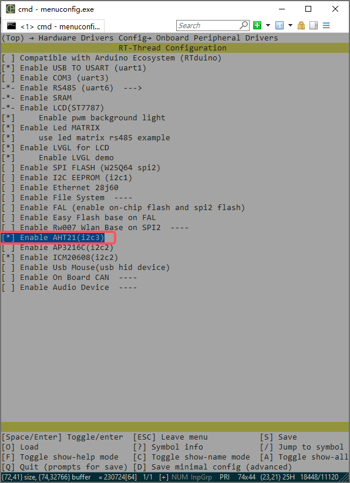

	

2. 器件初始化，并加入INIT_DEVICE_EXPORT

	```c
	#include <board.h>
	#include <rtthread.h>
	#include <drv_gpio.h>
	#include "aht10.h"
	
	// AHT挂载的总线名字
	#define AHT10_I2C_BUS "i2c3"
	
	// AHT设备指针
	aht10_device_t Dev = RT_NULL;
	
	// AHT测试样例
	int AHT10_Init(void)
	{
	    // 初始化设备
	    Dev = aht10_init(AHT10_I2C_BUS);
	    if (Dev == RT_NULL)
	    {
	        rt_kprintf("AHT10_init Fail");
	        return 0;
	    }
	    return 1;
	}
	INIT_DEVICE_EXPORT(AHT10_Init);
	```

	

3. 创建 tid_aht10 线程

	```c
	/* tid_aht10线程参数 */
	#define THREAD3_PRIORITY         25
	#define THREAD3_STACK_SIZE       1024
	#define THREAD3_TIMESLICE        5
	
	/* 创建线程tid_aht10 */
	tid_aht10 = rt_thread_create("tid_aht10",
	                             aht10_read, RT_NULL,
	                             THREAD3_STACK_SIZE,
	                             THREAD3_PRIORITY, THREAD3_TIMESLICE);
	/* 如果获得线程控制块，启动这个线程 */
	if (tid_aht10 != RT_NULL)
	    rt_thread_startup(tid_aht10);
	```

	线程入口函数：

	```c
	/* 线程 3 的入口函数 */
	static void aht10_read(void *parameter)
	{
	    while(1)
	    {
	        // 读取温湿度值
	        Humi = aht10_read_humidity(Dev);
	        Temp = aht10_read_temperature(Dev);
			
	        // 将温湿度数据转化为字符串
	        rt_sprintf(buf_Temp, LV_SYMBOL_HOME "%d.%d", (int)Temp, (int)(Temp * 10) % 10);
	        // lv_label_set_text(label_Temp, buf_Temp);
	        rt_sprintf(buf_Humi, LV_SYMBOL_BELL "%d.%d", (int)Humi, (int)(Humi * 10) % 10);
	        // lv_label_set_text(label_Humi, buf_Humi);
	    }
	}
	```

	*注意：最好不要读完数据直接显示到屏幕上，会和lvgl线程有时序冲突，字会一闪一闪，显示和读取分开，各司其职*

### b.lvgl制作UI界面

1. 使用Gui Guider绘制初始界面，并将代码导出到RT-Thread

	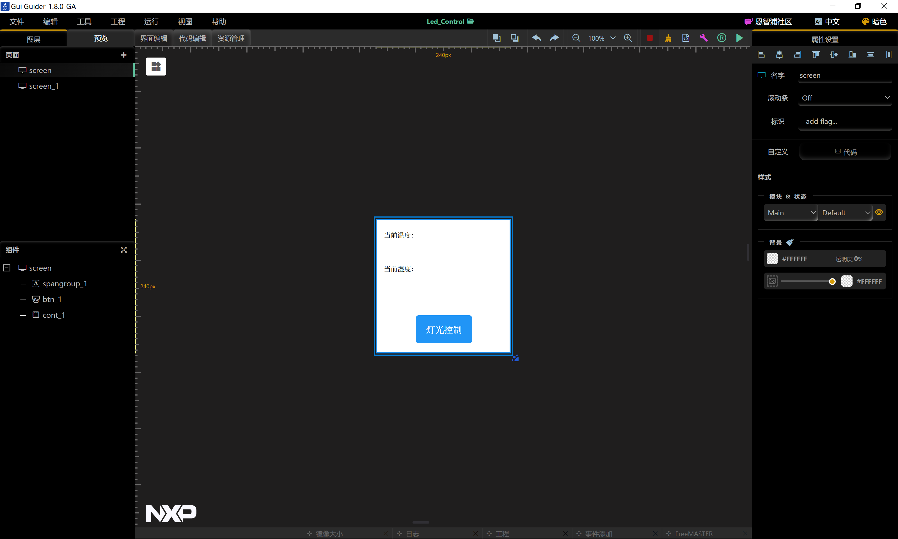

	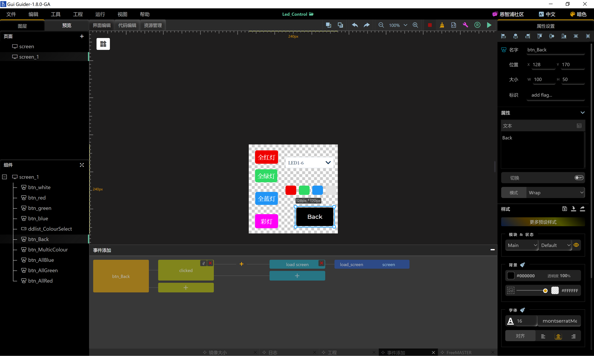

	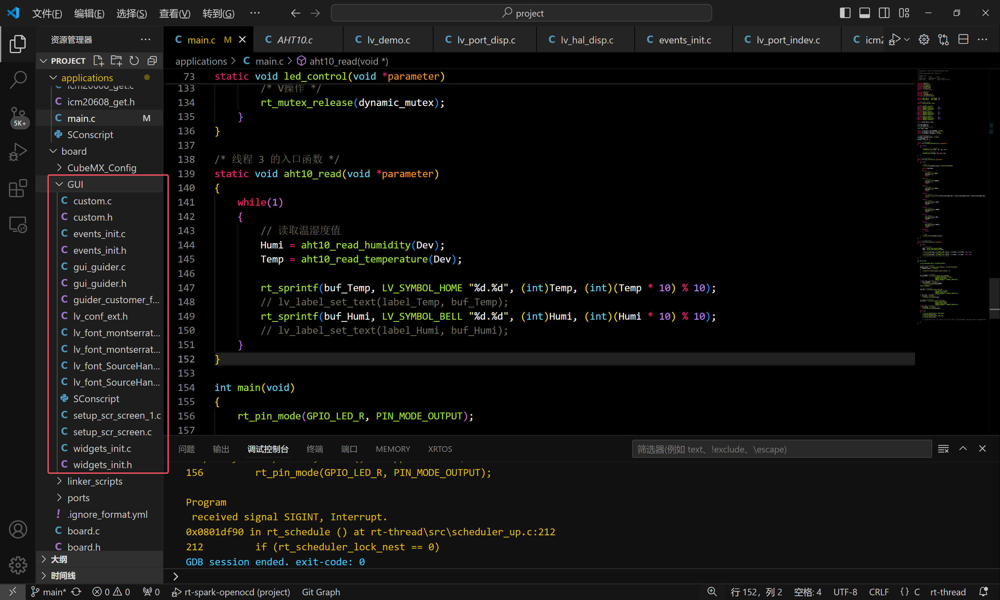

2. menuconfig使能lvgl

	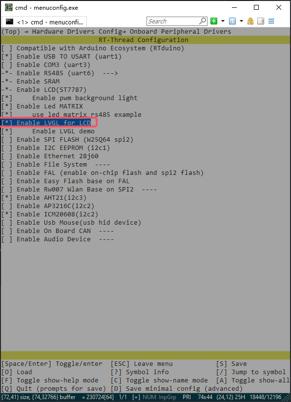

3. 在*board/ports/lvgl/demo/lv_demo.c*中启动lvgl界面初始化，并编写之前的温湿度动态文本显示

	```c
	#include <lvgl.h>
	#include "events_init.h"
	#include "gui_guider.h"
	
	lv_ui guider_ui;
	// extern lv_ui guider_ui;
	lv_obj_t* label_Temp;
	lv_obj_t* label_Humi;
	
	void lv_user_gui_init(void)
	{
		setup_ui(&guider_ui);
	    events_init(&guider_ui);
	
	    // 温度动态文本
	    label_Temp = lv_label_create(lv_scr_act());
	    lv_label_set_long_mode(label_Temp,LV_LABEL_LONG_WRAP);//设置长文本模式
	    lv_obj_set_pos(label_Temp,60,50);//设置坐标
	    lv_obj_set_style_text_font(label_Temp, &lv_font_montserrat_36, 0);
	    // lv_label_set_text(label_Temp, buf_Temp);
	
	    // 湿度动态文本
	    label_Humi = lv_label_create(lv_scr_act());
	    lv_label_set_long_mode(label_Humi,LV_LABEL_LONG_WRAP);//设置长文本模式
	    lv_obj_set_pos(label_Humi,60,120);//设置坐标
	    lv_obj_set_style_text_font(label_Humi, &lv_font_montserrat_36, 0);
	    // lv_label_set_text(label_Humi, buf_Humi);
	}
	```

	*注意：温湿度动态文本显示仍不能放在这里就输出，这里只进行界面初始化，仅能显示一次，应在lvgl刷新函数里实时更新*

	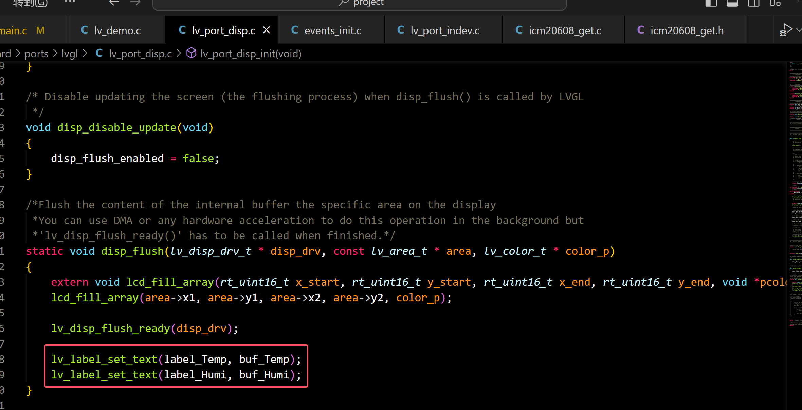

	字体太小可以在lv_config.h中改字体

	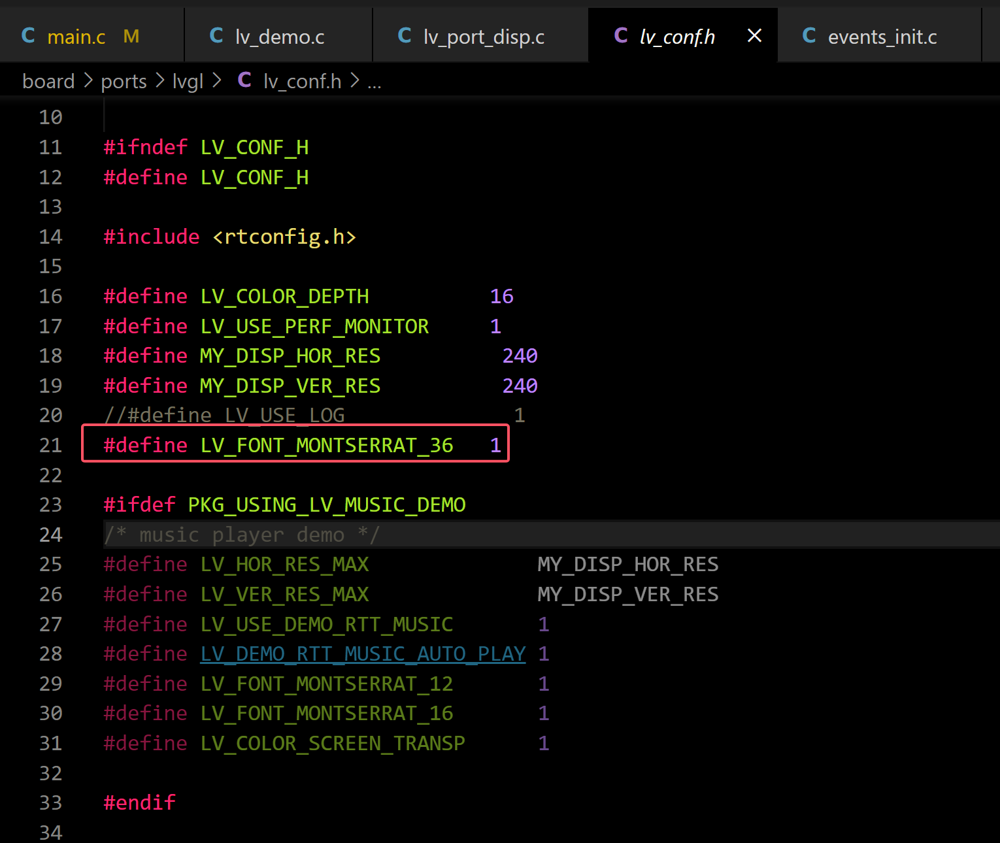

### c.按键和陀螺仪实现lvgl输入设备

由于星火一号上的lcd屏不支持触摸，只能按键控制，但板子上只有4个按键，要想实现比较完整的控件响应实体按键至少需要5个按键。于是我想到使用板子上的icm20608陀螺仪，求出欧拉角，通过将板子上下左右反转就可以代替4个按键，再加上板子原本的4个按键，就有8个按键，绰绰有余。最后，我将陀螺仪模拟的4个按键和板上的1个按键绑定到了lvgl的控件，实现了人机交互

#### icm20608陀螺仪驱动及互补滤波求出欧拉角

1. menuconfig开启icm20608

	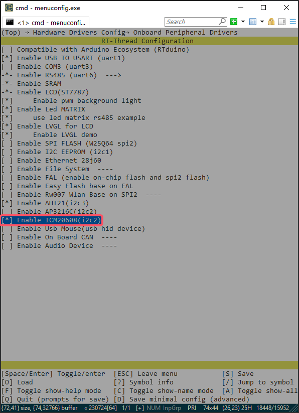

2. 器件初始化，并加入INIT_DEVICE_EXPORT

	```c
	int icm20608_start(void)
	{
	    const char *i2c_bus_name = "i2c2";
	    rt_err_t result;
	
	    rt_int16_t accel_x, accel_y, accel_z;
	
	    rt_int16_t gyros_x, gyros_y, gyros_z;
	
	    int count = 0;
	
	    /* 初 始 化 icm20608 传 感 器 */
	    dev = icm20608_init(i2c_bus_name);
	    if (dev == RT_NULL)
	    {
	        rt_kprintf("The sensor initializes failure\n");
	        return 0;
	    }
	    else
	    {
	        rt_kprintf("The sensor initializes success\n");
	    }
	
	    /* 对 icm20608 进 行 零 值 校 准： 采 样 10 次， 求 取 平 均 值 作 为 零 值 */
	    result = icm20608_calib_level(dev, 10);
	    if (result == RT_EOK)
	    {
	        rt_kprintf("The sensor calibrates success\n");
	        rt_kprintf("accel_offset: X%6d Y%6d Z%6d\n", dev->accel_offset.x, dev->accel_offset.y, dev->accel_offset.z);
	        rt_kprintf("gyro_offset : X%6d Y%6d Z%6d\n", dev->gyro_offset.x, dev->gyro_offset.y, dev->gyro_offset.z);
	    }
	    else
	    {
	        rt_kprintf("The sensor calibrates failure\n");
	        icm20608_deinit(dev);
	        return 0;
	    }
	
	    return 1;
	}
	INIT_DEVICE_EXPORT(icm20608_start);
	```

	

3. 互补滤波求欧拉角算法

	```c
	rt_int16_t Ax, Ay, Az, Gx, Gy, Gz;
	param_imu imu_data;
	param_Angle imu_Angle;
	 
	float q[4] = {1.0,0.0,0.0,0.0};
	float exInt = 0.0,eyInt = 0.0,ezInt = 0.0;
	 
	float fast_sqrt(float x)
	{
		float halfx = 0.5f * x;
		float y = x;
		long i = *(long *) &y;
		i = 0x5f3759df - (i>>1);
		y = *(float *) &i;
		y = y * (1.5f-(halfx * y * y));
		return y;
	}
	 
	void IMU_GetValues(void)
	{
		// /* 读 取 三 轴 加 速 度 */
	    // icm20608_get_accel(dev, &Ax, &Ay, &Az);
	
	    // /* 读 取 三 轴 陀 螺 仪 */
	    // icm20608_get_gyro(dev, &Gx, &Gy, &Gz);
	
		//Full Scale +-16 g
		imu_data.AX = ((float)Ax)*32/65536;
		imu_data.AY = ((float)Ay)*32/65536;
		imu_data.AZ = ((float)Az)*32/65536;
		//Full Scale +-2000 degree/s
		imu_data.GX = ((float)Gx)*4000/65536/180*pi;
		imu_data.GY = ((float)Gy)*4000/65536/180*pi;
		imu_data.GZ = ((float)Gz)*4000/65536/180*pi;
	}
	 
	void IMU_AHRSupdate(param_imu* imu_temp)
	{
		float ax,ay,az;
		float gx,gy,gz;
		float vx,vy,vz;
		float ex,ey,ez;
		ax = imu_temp->AX;
		ay = imu_temp->AY;
		az = imu_temp->AZ;
		gx = imu_temp->GX;
		gy = imu_temp->GY;
		gz = imu_temp->GZ;
		float q0 = q[0];
		float q1 = q[1];
		float q2 = q[2];
		float q3 = q[3];
		float norm = fast_sqrt(ax*ax+ay*ay+az*az);
		ax = ax * norm;
		ay = ay * norm;
		az = az * norm;
		vx = 2 * (q1*q3 - q0*q2);
		vy = 2 * (q2*q3 + q0*q1);
		vz = q0*q0 - q1*q1 - q2*q2 + q3*q3;
		ex = ay*vz - az*vy;
		ey = az*vx - ax*vz;
		ez = ax*vy - ay*vx;
		exInt += Mohony_Ki * ex;
		eyInt += Mohony_Ki * ey;
		ezInt += Mohony_Ki * ez;
		gx += Mohony_Kp * ex + exInt;
		gy += Mohony_Kp * ey + eyInt;
		gz += Mohony_Kp * ez + ezInt;
		q0 += (-q1*gx-q2*gy-q3*gz) * half_T;
		q1 += ( q0*gx+q2*gz-q3*gy) * half_T;
		q2 += ( q0*gy-q1*gz+q3*gx) * half_T;
		q3 += ( q0*gz+q1*gy-q2*gx) * half_T;
		norm = fast_sqrt(q0*q0+q1*q1+q2*q2+q3*q3);
		q[0] = q0 * norm;
		q[1] = q1 * norm;
		q[2] = q2 * norm;
		q[3] = q3 * norm;
	}
	 
	void IMU_getEuleranAngles(void)
	{
		IMU_GetValues();
		IMU_AHRSupdate(&imu_data);
		imu_Angle.Pitch = asin(-2*q[1]*q[3]+2*q[0]*q[2])*180/pi;
		imu_Angle.Roll  = atan2(2*q[2]*q[3]+2*q[0]*q[1],-2*q[1]*q[1]-2*q[2]*q[2]+1)*180/pi;
		//If "imu_data.GZ" is too small, it is considered to be noise interference.(1 degree/s)
		if((imu_data.GZ*180/pi > 1.0f) || (imu_data.GZ*180/pi < -1.0f))
		{
			imu_Angle.Yaw  += imu_data.GZ*cycle_T*4*180/pi;
		}
	}
	
	```

	原文参考链接：[MPU6050实现Mahony互补滤波（程序使用江协科技模板）_mohony互补滤波-CSDN博客](https://blog.csdn.net/m0_73885374/article/details/137734376)

	

4. 创建tid_icm10608线程读原始六轴数据，并开定时器每5ms解算一次欧拉角

	tid_icm10608线程入口函数，不停获取原始6轴数据

	```c
	/* tid_icm10608线程参数 */
	#define THREAD1_PRIORITY         25
	#define THREAD1_STACK_SIZE       1024
	#define THREAD1_TIMESLICE        5
	
	/* 线程 1 的入口函数 */
	static void icm10608_NomalData(void *parameter)
	{
	    while (1)
	    {
	        /* 读 取 三 轴 加 速 度 */
	        icm20608_get_accel(dev, &Ax, &Ay, &Az);
	
	        /* 读 取 三 轴 陀 螺 仪 */
	        icm20608_get_gyro(dev, &Gx, &Gy, &Gz);
	    }
	}
	```

	软件定时器每5ms解算一次欧拉角

	```c
	/* 定时器1回调函数 */
	void timer5ms_icm20608GetAngle(void *parameter)
	{
	    IMU_getEuleranAngles();
		//rt_kprintf("roll: %.2f, pitch: %.2f, yaw: %.2f\n", imu_Angle.Roll, imu_Angle.Pitch, imu_Angle.Yaw);
	}
	
	/* 定时器的控制块 */
	static rt_timer_t timer1;
	
	void timer_icm20608(void)
	{
	    /* 创建定时器 1  周期定时器 */
	    timer1 = rt_timer_create("timer1", timer5ms_icm20608GetAngle,
	                             RT_NULL, 5,
	                             RT_TIMER_FLAG_PERIODIC | RT_TIMER_FLAG_SOFT_TIMER);
	
	    /* 启动定时器 1 */
	    if (timer1 != RT_NULL) rt_timer_start(timer1);
	}
	```

#### lvgl绑定输入设备

1. 在*board/ports/lvgl/lv_port_indev*中编写输入设备初始化

	```c
	lv_indev_drv_t indev_drv;
	lv_indev_t* keypadIndevice;
	
	void lv_port_indev_init(void)
	{
	    //板上四个按键初始化，实际只用到了KEY_DOWN
	    rt_pin_mode(KEY_DOWN, PIN_MODE_INPUT_PULLUP);
	    rt_pin_mode(KEY_LEFT, PIN_MODE_INPUT_PULLUP);
	    rt_pin_mode(KEY_RIGHT, PIN_MODE_INPUT_PULLUP);
	    rt_pin_mode(KEY_UP, PIN_MODE_INPUT_PULLUP);
	
	    //创建键盘输入外设
	    lv_indev_drv_init(&indev_drv);
	    indev_drv.type = LV_INDEV_TYPE_KEYPAD;
	    indev_drv.read_cb = keypadRead;
	
	    keypadIndevice = lv_indev_drv_register(&indev_drv);
	
	}
	```

	

2. 编写检测函数keypadRead

	```c
	#define ANGLE_MAX       30
	
	uint8_t Key_Value;
	uint8_t Key_Down;
	uint8_t Key_Old;
	
	enum Key_Num{
	    UP = 1,
	    DOWN,
	    LEFT,
	    RIGHT,
	    CLICK
	};
	
	uint8_t icm20608_Read(void)
	{
	    if(!rt_pin_read(KEY_DOWN))
	    {
	        return CLICK;
	    }
	    if(imu_Angle.Roll < ANGLE_MAX && imu_Angle.Roll > -ANGLE_MAX && imu_Angle.Pitch < ANGLE_MAX && imu_Angle.Pitch > -ANGLE_MAX)
	    {
	        return 0;
	    }
	    else if(fabs(imu_Angle.Roll) > fabs(imu_Angle.Pitch) && imu_Angle.Roll > 0)
	    {
	        return DOWN;
	    }
	    else if(fabs(imu_Angle.Roll) > fabs(imu_Angle.Pitch) && imu_Angle.Roll < 0)
	    {
	        return UP;
	    }
	    else if(fabs(imu_Angle.Roll) < fabs(imu_Angle.Pitch) && imu_Angle.Pitch > 0)
	    {
	        return RIGHT;
	    }
	    else if(fabs(imu_Angle.Roll) < fabs(imu_Angle.Pitch) && imu_Angle.Pitch < 0)
	    {
	        return LEFT;
	    }
	}
	
	static void keypadRead(struct _lv_indev_drv_t * indev_drv, lv_indev_data_t * data)
	{
	    Key_Value = icm20608_Read();
	    Key_Down = Key_Value&(Key_Value^Key_Old);
	    Key_Old = Key_Value;
	
	    switch (Key_Down)
	    {
	    case CLICK/* constant-expression */:
	        /* code */
	        data->key = LV_KEY_ENTER;
	        data->state = LV_INDEV_STATE_PRESSED;
	        break;
	
	    case LEFT:
	        data->key = LV_KEY_PREV;
	        data->state = LV_INDEV_STATE_PRESSED;
	        break;    
	
	    case RIGHT:
	        data->key = LV_KEY_NEXT;
	        data->state = LV_INDEV_STATE_PRESSED;
	        break;
	
	    case DOWN:
	        data->key = LV_KEY_DOWN;
	        data->state = LV_INDEV_STATE_PRESSED;
	        break;     
	
	    case UP:
	        data->key = LV_KEY_UP;
	        data->state = LV_INDEV_STATE_PRESSED;
	        break;           
	    
	    default:
	        data->state = LV_INDEV_STATE_RELEASED;
	        break;
	    }
	
	}
	```

	

3. 给两个界面加入各自的组

	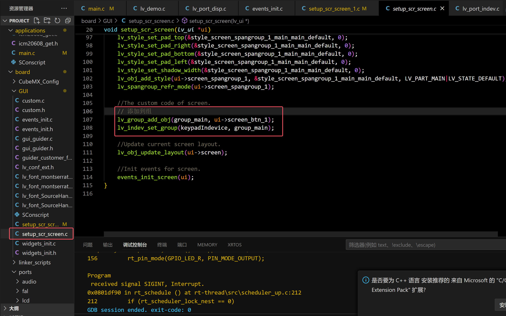

	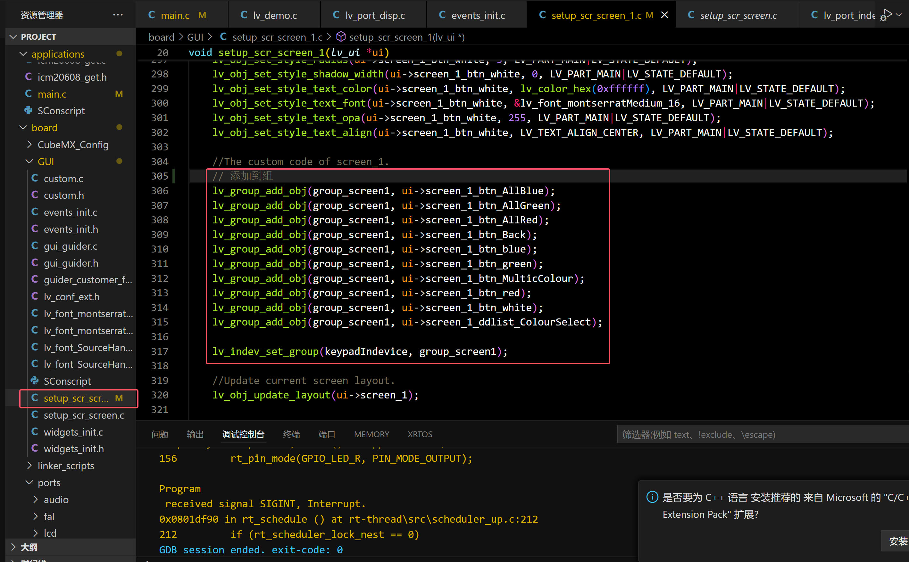

4. 在切换界面的按键处理事件中改变输入设备和组的绑定

	一开始输入设备绑定的是主界面的组group_main，当按下主界面切换按钮后，输入设备绑定下个界面的组group_screen1

	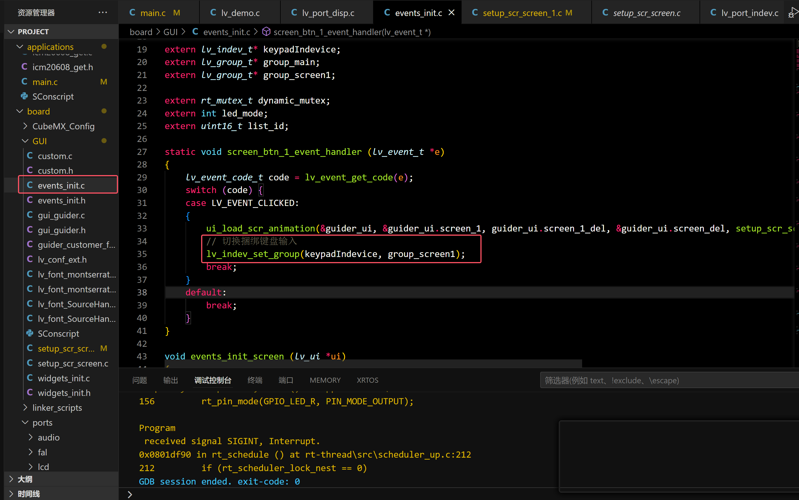

	当子界面想切回主界面，只需按下Back按钮，输入设备绑定主界面的组group_main

	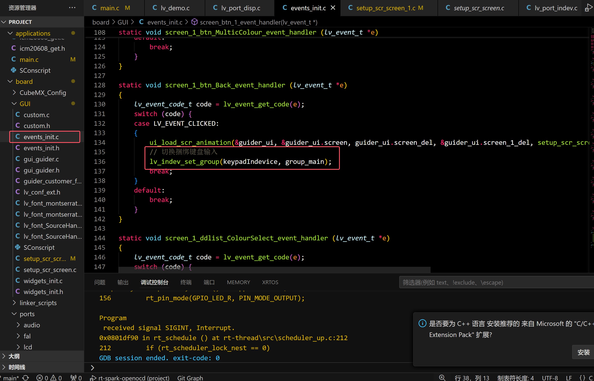

### d.led矩阵实现灯光控制

使用互斥锁协作矩阵灯控制线程和lvgl显示线程实现线程间同步

1. menuconfig使能led矩阵

	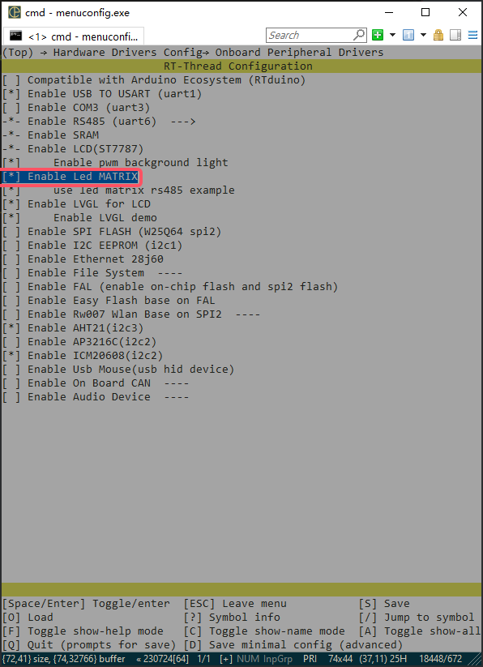

2. 创建tid_led线程，通过lvgl显示线程传过来的led_mode标志位控制led矩阵，led_mode用互斥锁保护

	```c
	/* tid_led线程参数 */
	#define THREAD2_PRIORITY         25
	#define THREAD2_STACK_SIZE       512
	#define THREAD2_TIMESLICE        5
	
	/* 线程 2 的入口函数 */
	static void led_control(void *parameter)
	{
	    while (1)
	    {
	        /* P操作 */ 
	        rt_mutex_take(dynamic_mutex, RT_WAITING_FOREVER);
	
	        switch (led_mode)
	        {
	        case 1:
	            /* 全红灯 */
	            led_matrix_fill(RED);
	            led_mode = 0;
	            break;
	
	        case 2:
	            /* 全绿灯 */
	            led_matrix_fill(GREEN);
	            led_mode = 0;
	            break;
	
	        case 3:
	            /* 全蓝灯 */
	            led_matrix_fill(BLUE);
	            led_mode = 0;
	            break;
	
	        case 4:
	            /* 彩灯，灯珠滚动 */
	            led_matrix_show_color((uint8_t)imu_Angle.Roll, (uint8_t)imu_Angle.Pitch, (uint8_t)imu_Angle.Yaw);
	            break;
	
	        case 5:
	            /* 1/3蓝灯 */
	            LED_Set(list_id, BLUE);
	            led_mode = 0;
	            break;
	
	        case 6:
	            /* 1/3绿灯 */
	            LED_Set(list_id, GREEN);
	            led_mode = 0;
	            break;
	
	        case 7:
	            /* 1/3红灯 */
	            LED_Set(list_id, RED);
	            led_mode = 0;
	            break;
	
	        case 8:
	            /* 1/3白灯 */
	            LED_Set(list_id, WHITE);
	            led_mode = 0;
	            break;
	        
	        default:
	            break;
	        }
	
	        /* V操作 */ 
	        rt_mutex_release(dynamic_mutex);
	    }
	}
	```

	

3. lvgl显示线程控制的led_mode标志位

	lvgl按钮一旦按下，就改变对应的led_mode标志位，用互斥锁保护，由于按钮比较多，只展示其中一个

	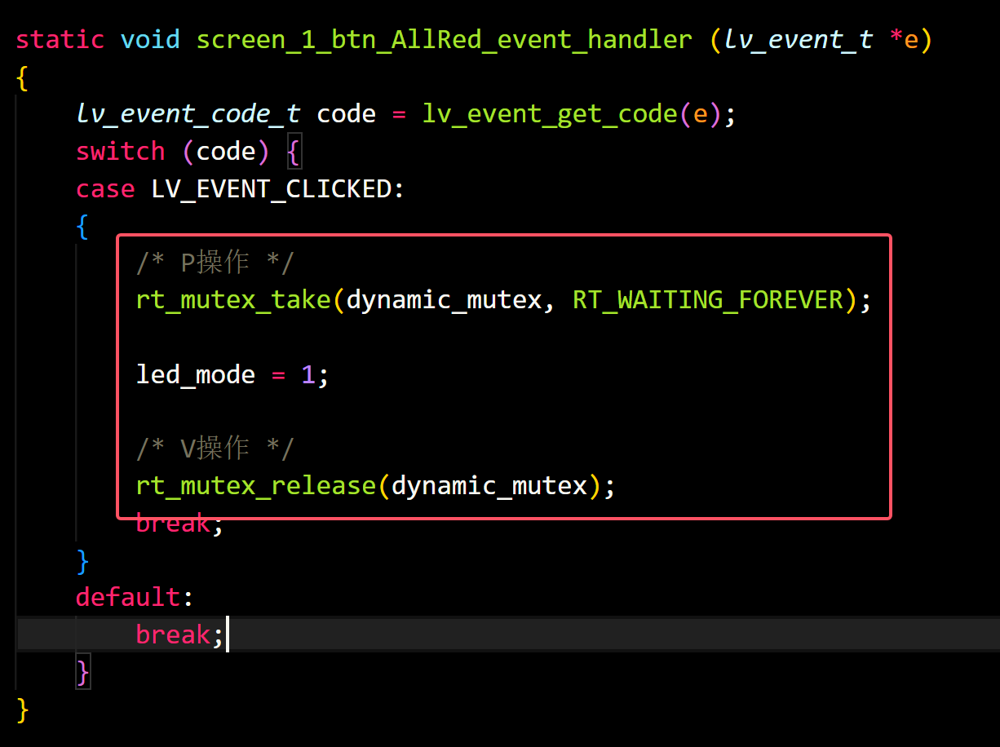

## 三、开发过程中遇到的问题及解决方法

### 问题1：lvgl控件添加到组后按键没反应

之前我在添加控件到组时，选择直接创建一个全局变量guider_ui去加入控件，其实自己创建的新变量即使数据类型和函数形参一致，但它本身是没有任何意义的，没有绑定具体控件，只有内存

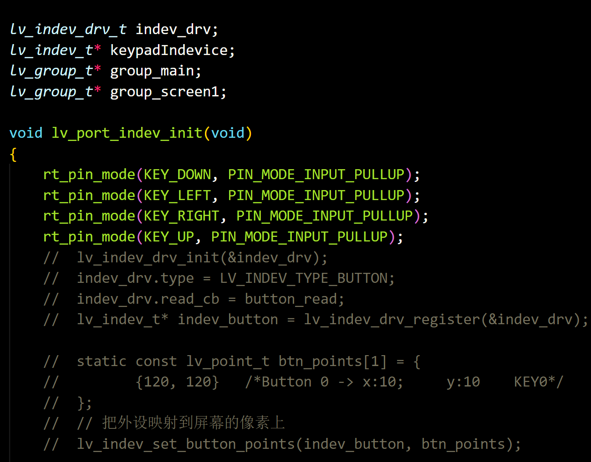

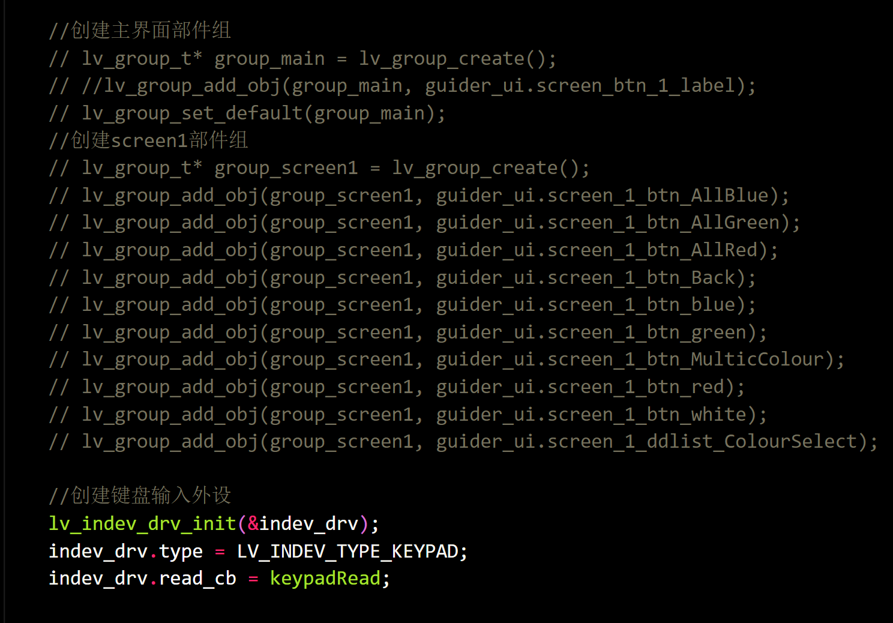

#### 解决方法

B站UP主大波丁教程：[RTThread+LVGL项目开发05（多屏界面）_哔哩哔哩_bilibili](https://www.bilibili.com/video/BV1za4y1w77U/?spm_id_from=333.788&vd_source=cb3035aabee93b98268db84a2ab962fc)

了解到需要真正有意义的控件类型只能去初始化控件的函数中，由于初始化控制时使用的是传进来的形参，所以直接再控件初始化函数中加入组


### 问题2：陀螺仪转按键算法

```c
uint8_t icm20608_Read(void)
{
    if(!rt_pin_read(KEY_DOWN))
    {
        return CLICK;
    }
    if(imu_Angle.Roll < ANGLE_MAX && imu_Angle.Roll > -ANGLE_MAX && imu_Angle.Pitch < ANGLE_MAX && imu_Angle.Pitch > -ANGLE_MAX)
    {
        return 0;
    }
    else if(fabs(imu_Angle.Roll) > fabs(imu_Angle.Pitch) && imu_Angle.Roll > 0)
    {
        return DOWN;
    }
    else if(fabs(imu_Angle.Roll) > fabs(imu_Angle.Pitch) && imu_Angle.Roll < 0)
    {
        return UP;
    }
    else if(fabs(imu_Angle.Roll) < fabs(imu_Angle.Pitch) && imu_Angle.Pitch > 0)
    {
        return RIGHT;
    }
    else if(fabs(imu_Angle.Roll) < fabs(imu_Angle.Pitch) && imu_Angle.Pitch < 0)
    {
        return LEFT;
    }
}
```


#### 解决方法

先要把6轴原始数据转换成欧拉角，在网上找到算法并应用。转成4个按键只需要用到roll角和pitch角，将其转换成二维坐标系进行键值分割

icm20608转按键讲解

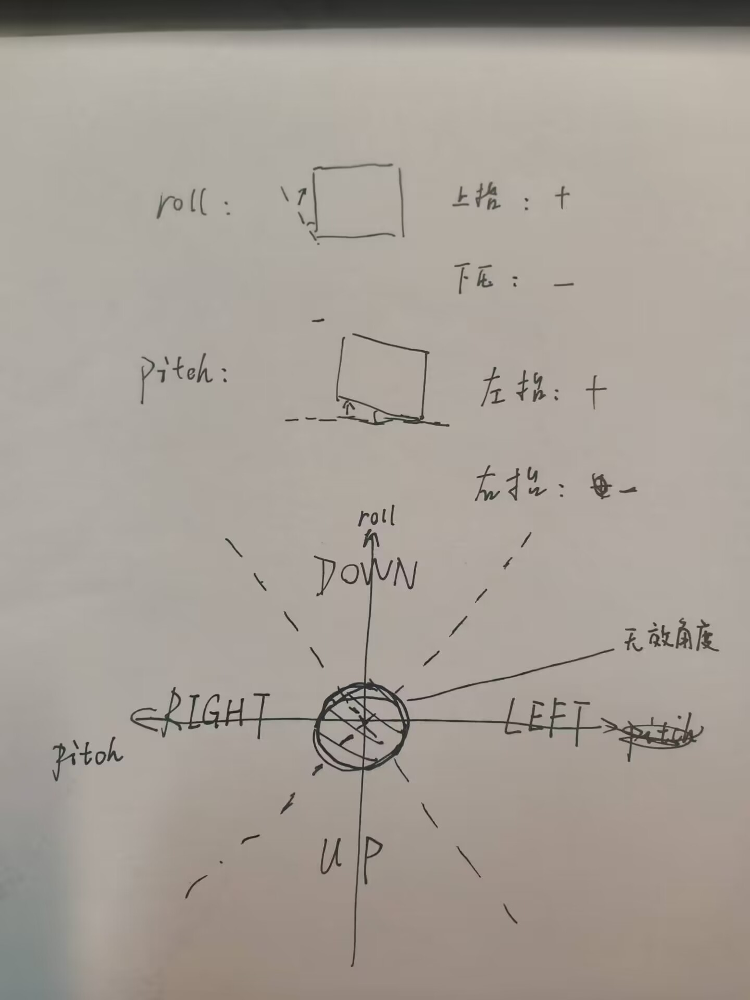

### 问题3：线程间优先级冲突

再led线程中，由于线程优先级设置的比陀螺仪线程、aht21线程优先级高，且互斥锁等待方式设置为永久等待，导致陀螺仪翻滚屏幕没反应、aht21数据不显示

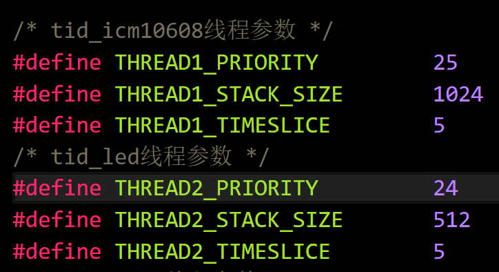

#### 解决方法

通过再串口终端输入ps命令查看线程信息

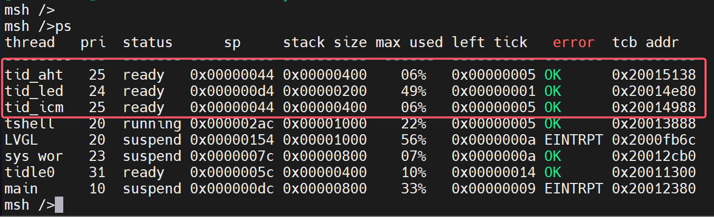

发现tid_aht和tid_icm基本没有运行，改变优先级顺序后成功解决

## 四、总结

再本次RT-Thread夏令营中我主要学习了lvgl的使用，及利用env中rtthread组件进行非常方便的开发。本项目中，内核相关的组件用的比较少，只用了互斥锁。主要还是因为项目比较简单，如果加上上云的话还可以用一下消息队列。

最后，感谢褚仕成老师的指导，在我的开发过程中提供了很多方法和思路。


